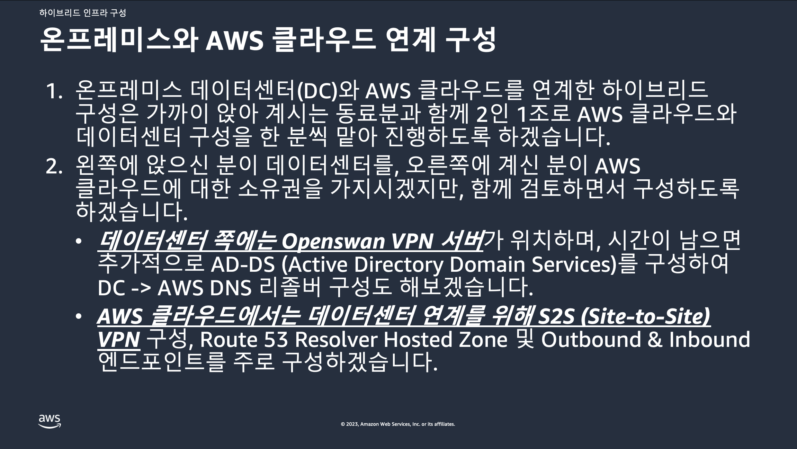
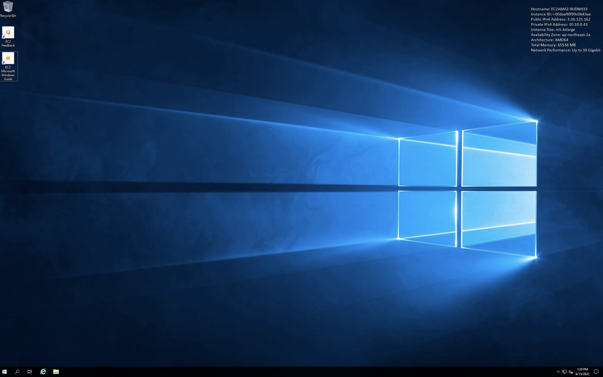
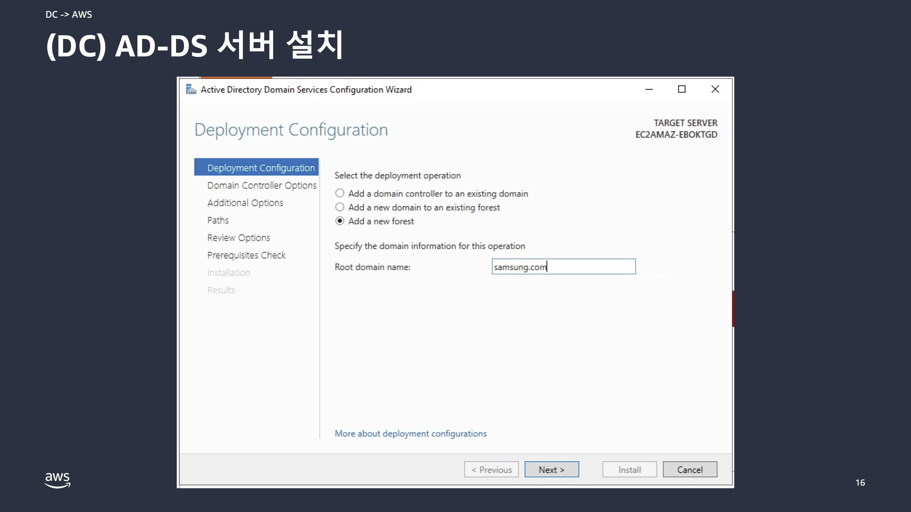
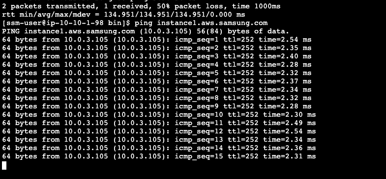

# 하이브리드 클라우드 연결

오늘은 온프레미스 인프라와 AWS를 연계하여 운영하는데 기초가 되는 하이브리드 클라우드 연결을 알아보도록 하겠습니다.<br>
대개의 경우 클라우드 마이그레이션 과정은 단기간에 마무리되지 않으므로, 기존의 IT 환경과 (예: 온프레미스 데이터센터)와 일정 기간 연계하여 운영하는 것이 일반적입니다.

온프레미스 데이터센터와 AWS 클라우드를 연결하는 기술은 일반적으로 Site-to-Site VPN이나 Direct Connect 등을 사용하며, 이렇게 연결된 후에는 다양한 형태의 IT 인프라가 논리적/물리적으로 연계되게 됩니다.

오늘은 Site-to-Site VPN을 사용하여 가상의 온프레미스 데이터센터와 AWS 클라우를 연결하고 이를 바탕으로 DNS를 연계시켜 보도록 하겠습니다.

참고로 이 핸즈온 가이드는 아래 두 워크샵을 조합하여 정리한 것입니다.<br>
- [Networking Immersion Day](https://catalog.workshops.aws/networking/en-US/beginner/lab1)
- [하이브리드 DNS](https://aws-labs.net/winlab0-buildinfra/hybriddns.html)

## Agenda

실습은 2인 1조로 진행하면 좋습니다.

1. 환경 구성<br>
  
   - (위에서 3번 링크 항목은 참고만 하시면 되고 각자 맡으신) 아래 항목을 수행하시면 됩니다.)<br>
   - (참고) [Networking Immersion Day](https://catalog.workshops.aws/networking/en-US/beginner/lab1)
   - [AWS 클라우드 측 구성](./docs/aws-cloud-setup.md)<br>
   - [데이터센터 측 구성](./docs/datacenter-setup.md)<br>

2. AWS와 DC 환경 연결
    - [(AWS 측) Customer Gateway 생성](./docs/create-customer-gateway.md)
    - [(DC 측) VPN 연결 설정](./docs/setup-vpn-connection.md)
    - [(AWS 측) AWS로부터 데이터센터 네트워크에 접속 테스트](./docs/aws-test-vpn-connection-to-dc.md)

3. AWS -> 데이터센터 (Outbound) DNS 질의 구성 (example.corp 도메인)
    - [(AWS 측) Route 53 리졸버 설정](./docs/aws-setup-route53-resolver.md) 

4. 데이터센터 -> AWS (Inbound) DNS 질의 구성 (aws.samsung.com 도메인)
    - 아래 가이드에 따라 구성해 봅니다.

[//]: # (우리가 구성하는 데이터 센터 <-> AWS 클라우드 연계된 모습은 다음과 같습니다.)

[//]: # ()
[//]: # (https://www.linkedin.com/pulse/sharedcentralised-services-aws-transit-gateway-ibrahim-kunduraci/)

5. (Optional) 임직원 중 일부를 AWS 클라우드 콘솔에 SSO 접근 권한 부여하기 (ADFS 사용)

---

## 데이터센터 -> AWS (Inbound) DNS 질의 구성 (aws.samsung.com 도메인)

해당 실습은 강사 가이드에 따라 아래에 기술된 순서대로 수행합니다.

### 개요: Route 53 Inbound Resolver (DC -> AWS)
- 참고 사이트
  - https://aws-labs.net/winlab0-buildinfra/hybriddns.html
  - Step 3: Configuring Route 53 Inbound Resolver (DC -> AWS Cloud)


### 수행해야 할 작업
1. (DC) AD-DS 서버 설치 
   - Domain: samsung.com
2. (AWS) Route 53 Private Hosted Zone 
   - Domain: aws.samsung.com 
   - 이 서브 도메인이 DC -> AWS로 Conditional Forwarding 될 것입니다.
3. (AWS) Route 53 Inbound Endpoint 설정
4. (DC) AWS로 Conditional Forwarding 설정
5. (DC) DC -> AWS 서버 Ping 테스트 (DNS 이름 사용)
6. (Opitonal; AWS 추가 설정) "samsung.com" Outbound Resolver Rule 설정

### 1. (DC) AD-DS 서버 설치
> * 필요한 인스턴스 설치를 위해 참고할 URL
>    - https://docs.aws.amazon.com/ko_kr/directoryservice/latest/admin-guide/microsoftadtruststep1.html
> * 인스턴스 AMI 
>    - Microsoft Windows Server 2019 Base - ami-xxxxxxxxxxxxxxxxx 
> * 인스턴스 타입 
>    - m5.4xlarge 등 부족하지 않은 사양 
> * 인스턴스 타입 참고: https://aws.amazon.com/ko/ec2/instance-types/
>    - Security Group은 "3389: 0.0.0.0/0 ", "모든 트래픽: 10.0.0.0/8"으로 지정합니다. 

1. 데이터센터의 Public Subnet에 AD-DS (Active Directory Domain Service) 서버 설치
    - 해당 서버는 원활한 작업을 위해 ```OnPremVpc-Network-Immday-DC``` VPC의 Public Subnet에 설치한 후 원격 데스크탑을 통해 접속합니다.
    - 인스턴스 이름은 ```DC-DNS-Server```로 지정합니다.
    - 키 페어는 새로 생성하되 이름은 ```dc-keypair```로 지정합니다.
    - 보안 그룹 설정 이름은 ```DC-DNS-Server```로 합니다.
      - 보안 그룹 규칙 1: 유형 - RDP, 소스 유형 - 위치 무관 (이미 지정되어 있습니다)
      - 보안 그룹 규칙 2 (추가): 유형 - 모든 트래픽, 소스 유형 - 사용자 지정, 소스 - 10.0.0.0/8
    - 스토리지 용량: 100 GiB

    <br>
    <br>
    <br>

2. 생성된 AD-DS 서버에 원격 데스크탑 (RDP)으로 연결합니다.<br>
네트워크 제약에 의해 RDP 연결이 허용되지 않을 경우, 모바일 테더링을 통해 접속하도록 합니다.<br>

    - 인스턴스 생성 시에 함께 생성한 Private Key 파일을 사용하여 초기 암호를 확인합니다.<br>
    - 최초 로그인 이후 이후 원활한 접속을 위해 Administrator 암호를 변경합니다.<br>

    

3. 강사의 안내에 따라 AD-DS 서버에서 필요한 기능을 설치합니다.<br>
   1.  ```시작 메뉴``` > ```Server Manager``` > ```Add roles and features```

    <br>
   2. 아래 세개의 서버 Role을 선택합니다.
       1. ```Active Directory Domain Services```
       2. ```Active Directory Federation Services```
       3. ```Active Directory Lightweight Directory Services```
       4. (Optional) 추가로 ```Feautres``` 화면에서 ```Telnet Client``` 도 선택하여 설치해 주면 좋습니다.

   <br>

   3. 서버 구성 요소 설치가 완료되면 ```Server Manager``` 화면에 표시되는 ```Promote this server as a domain controller``` 실행 링크를 클릭합니다.

    <br>

   4. 표시되는 화면에서 ```Add a new forest```를 선택하고 ```Root domain name```에 ```samsung.com```을 입력합니다. 

    <br>

   5. 자신이 원하는 암호를 설정합니다.

    <br>
   6. 이후 과정에서는 기본적으로 제시되는 값을 받아들이고 진행합니다.<br>
   <br>
   <br>
   <br>
   <br>
   <br>
   <br>

    7. 모든 설정이 완료되면 시스템이 재시작됩니다.

### 2. (AWS) Route 53 Private Hosted Zone
1. Route 53 Private Hosted Zone 생성
   - AWS 콘솔: ```Route 53``` > ```호스팅 영역 (Hosted zones)```<br>
   - 도메인 이름: ```aws.samsung.com```<br>
   - 유형: ```프라이빗 호스팅 영역```<br>
   - 호스팅 영역과 연결할 VPC: EC2 인스턴스가 존재하는 ```ap-northeast-2``` 리전의 ```VPC 0```, ```VPC 1```, ```VPC 2``` 모두 추가<br>
   - 이 서브 도메인이 DC -> AWS로 Conditional Forwarding 될 것입니다.<br>

      <br>
      <br>

2. VPC 0, 1, 2에 생성되어 있는 EC2 인스턴스 세 개의 IP를 생성된 호스팅 영역의 A 레코드로 추가
   - A 레코드 이름은 ```www<n>``` 혹은 ```instance<n>``` 과 같은 형식으로 지정. 예) ```www1```  

       


### 3. (AWS) Route 53 Inbound Endpoint 설정

1. 온프레미스 데이터센터로부터 DNS 질의를 받을 수 있도록 Inbound Endpoint를 생성해 줍니다.
    - AWS 콘솔: ```Route 53``` > ```확인자 (Resolver)```> ```인바운드 엔드포인트 (Inbound Endpoints)```
    - 이름: ```DC2AWS```
    - VPC: ```VPC 0``` 선택
    - 보안 그룹: 해당 VPC에 생성된 ```DC2AWS-Ec2Stack-0-XXX```와 같은 이름을 가진 디폴트가 아닌 보안 그룹
    - 엔드포인트 유형: ```IPv4```
    - IP 주소 #1
      - 가용 영역: ```ap-northeast-2a```
      - 서브넷: Private Subnet 선택
      - ```자동으로 선택된 IPv4 주소 사용``` 선택
    - IP 주소 #2
      - 가용 영역: ```ap-northeast-2c```
      - 서브넷: Private Subnet 선택
      - ```자동으로 선택된 IPv4 주소 사용``` 선택
 
    > (주의) Region (리전)이 서울 (ap-northeast-2) 임을 확인하고 작업합니다.

    <br>
    <br>
    <br>
    <br>

2. 생성된 Inbound Endpoint의 IP 주소 (2개)를 기록하고 DC 담당자 분께 전달합니다. 이 주소는 AD-DS 서버에서 Subdomain에 대한 DNS 질의를 전달 (Forward) 하기 위한 설정에 사용됩니다.

    

### 4. (DC) AWS로 Conditional Forwarding 설정

위 3에서 AWS 측에 생성된 Route 53 Inbound Endpoint 주소를 사용하여 ```aws.samsung.com``` 서브 도메인에 대해서 AWS 측으로 DNS 쿼리를 전달하도록 설정합니다.

1. AD-DS 서버의 ```DNS Manager 스냅인```을 열고 ```Forward Lookup Zones (samsung.com)```에 ```aws``` 서브 도메인 위임 (Delegation)을 추가합니다.<br>

    <br>
    <br>
    <br>
    <br>

    > (참고) <br>
    "A timeout occurred during validation ..." 관련 에러는 Windows DNS 서버가 SOA 레코드를 요청하는데 Route 53 Resolver가 여기에 응답하지 않음에 따라 나타나는 현상으로 무시하고 진행해도 무방합니다.<br>
    > - https://serverfault.com/questions/956050/conditional-forwarding-to-aws-route-53-nameserver-fails-validation

   <br>
   <br>

2. ```Conditional Forwarders```를 설정합니다.<br>

    <br>
    <br>

   > (참고) <br>
   "The server with this IP address is not authoritative for the required zone." 관련 에러도 Route 53 Inbound Endpoint가 SOA (Start of Authority)로 동작하지 않는 Recursive Resolver 임을 나타내는 것으로 무시하고 진행할 수 있습니다.<br><br>

   > <u>**(도전!!!)<br>**</u>
   > 만약 ```A timeout occurred ...```와 같은 오류 메시지가 표시되면 보안 그룹, 라우팅 테이블과 같은 네트워크 관련 내용을 살펴보아야 합니다.<br>
   > <u>***어느 부분의 설정이 잘못된 것일까요?***</u><br><br>
   > (힌트)
   > DC -> AWS로 흘러가는 네트워크 트래픽의 게이트웨이 역할을 하는 VPN 장비, 즉, 우리 구성에서는 ```Bastion``` 호스트와 관련된 설정을 살펴보시면 됩니다.
   > <br><br>
   > 설정을 한 이후에는 AD-DS 서버에서 AWS의 인스턴스 중 하나에 (VPC 0, 1, 혹은 2) IP 주소를 사용하여 Ping이 정상적으로 도달하는지 점검해 봅니다.

   <br>

[//]: # (3. Customer Gateway인 Bastion Host의 Security Group에서 모든 트래픽에 대해 ```10.0.0.0/8``` 대역을 소스로 추가해 줍니다.<br>)

[//]: # ()
[//]: # (    ![]&#40;./docs/assets/dc-bastion-host-security-add-for-dc-2-aws.png&#41;)


### 5. (DC) DC -> AWS 서버 Ping 테스트 (DNS 이름 사용)

1. 우선 데이터센터의 DNS 서버 (AD-DS 윈도우 서버)에서 AWS 클라우드에 위치한 인스턴스 중 하나로 DNS 이름으로 Ping을 테스트해 봅니다.<br>
아래 그림에서는 ```instance1.aws.samsung.com``` DNS 호스트 이름을 사용한 것으로 나타나지만 설정에 따라 다를 수 있습니다. (예: ```ping www0.aws.samsung.com```)
 
    

2. 이번에는 어플리케이션 서버의 ```/etc/resolv.conf``` 파일을 수정하여, AD-DS 서버를 DNS 서버로 설정한 후 AWS 클라우드의 인스턴스에 Ping이 수행되는지 확인합니다.

    ```bash
    sudo vi /etc/resolv.conf
    ```
   
    <br>
    <br>

### 6. (Opitonal; AWS 추가 설정) "samsung.com" Outbound Resolver Rule 설정

우리는 앞서 ```example.corp```에 대해서 AWS -> DC로 DNS 질의가 수행되는 것을 확인하였습니다.<br>

시간이 허락하면 새롭게 구성된 AD-DS DNS 서버로 ```samsung.com``` 도메인에 대한 질의를 수행하는 작업을 진행해 보세요.
1. AWS 측에서 Outbound Resolver Rule 설정: ```samsung.com``` 도메인
2. AD-DS DNS 서버에 ```myapp.samsung.com``` A Record를 생성
3. AWS 인스턴스에서 아래 명령어를 실행하여 "Hello, world"가 반환되는 것을 확인
```bash
curl myapp.samsung.com
```

## (Optional) (Optional) 임직원 중 일부를 AWS 클라우드 콘솔에 SSO 접근 권한 부여하기 (ADFS 사용)
다음 기술 블로그를 사용하여 강사와 함께 (Ad-hoc) 임직원 중 일부를 AWS 클라우드 콘솔에 SSO 접근 권한을 부여해 보도록 하겠습니다. (ADFS 사용)
https://aws.amazon.com/blogs/security/enabling-federation-to-aws-using-windows-active-directory-adfs-and-saml-2-0/
