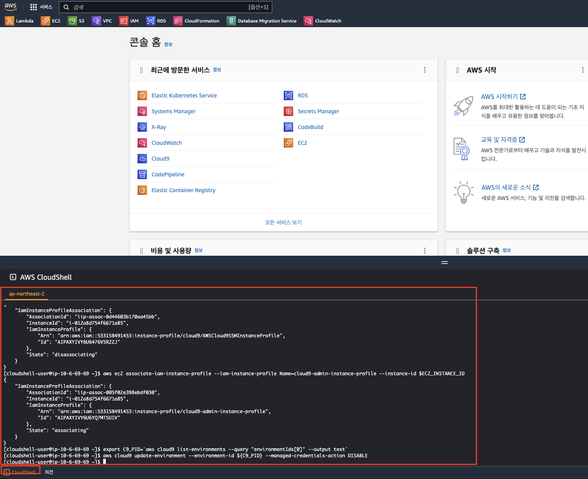
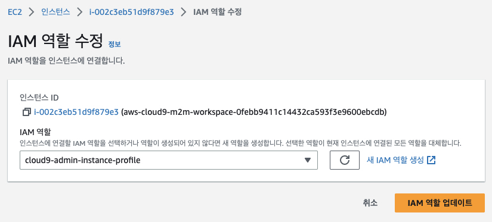
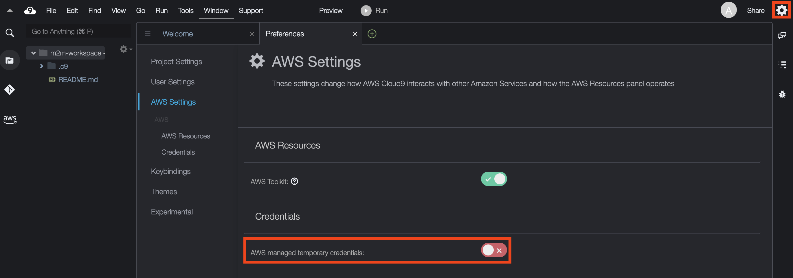

# AWS 클라우드 환경 구성하기

AWS 클라우드 환경은 강사에 의해 미리 공유된 AWS IaC 기능인 CDK (Cloud Development Kit)를 통해 배포됩니다.<br>
이를 배포하기 위하여 아래와 같이 Cloud9 환경을 구성하고, 각종 도구들을 설치합니다.<br>

참고로 여기에 기술된 환경 설정 방법은 오늘 실습에서는 사용되지 않지만 이전에 배웠던 쿠버네테스 환경을 위한 설정도 통합하여 기술하였으므로, 추후 필요할 경우 One-Stop Shop으로 참고할 수 있습니다.

## Agenda

1. Cloud9 시작하기
    * 1.1. AWS Cloud9 IDE 생성 (AWS CLI 사용)
    * 1.2. AWS Cloud9 IDE 생성 (AWS Management Console 사용)
        * 1.2.1. Cloud9 환경 생성
        * 1.2.2. IAM Role 생성
        * 1.2.3. IDE(AWS Cloud9 인스턴스)에 IAM Role 부여
        * 1.2.4. IDE에서 IAM 설정 업데이트
2. Cloud9 통합 설정 파일 실행
2. Cloud9 통합 환경 설정 파일 실행
3. AWS 클라우드 환경 구성 리포지터리 받기 (git clone)
4. AWS 클라우드 자원 생성

## 1. Cloud9 시작하기

AWS Cloud9으로 실습 환경을 구축하는 순서는 아래와 같습니다.

- AWS Cloud9으로 IDE 구성
- IAM Role 생성
- IDE(AWS Cloud9 인스턴스)에 IAM Role 부여
- IDE에서 IAM 설정 업데이트

### 1.1. AWS Cloud9 환경 생성 (AWS CLI 사용)
강사에 의해 제공된 AWS 관리 콘솔에서 ```CloudShell```을 실행한 후 아래 명령을 수행하여 ```Cloud9``` 환경을 생성해 줍니다.<br>
```CloudShell```도 다수의 개발 언어와 런타임, 그리고 클라우드 환경을 다룰 수 있는 CLI를 기본적으로 제공하지만 보다 풍부한 통합 개발 환경을 제공하는 ```Cloud9```을 사용하기로 합니다.<br>
```bash
curl -fsSL https://raw.githubusercontent.com/shkim4u/aws-datacenter-connectivity/main/cloud9/bootstrap-v2.sh | bash
```


### 1.1. AWS Cloud9으로 IDE 구성

1. [AWS Cloud9 콘솔창](https://console.aws.amazon.com/cloud9)에 접속한 후, Create environment 버튼을 클릭합니다.
2. Details에서 이름을 다음과 같이 ```cloud-workspace```으로 입력합니다.
```
hybrid-cloud-workspace
```

3. New EC2 Instance에서 인스턴스 타입 (Instance Type)으로 m5.large (8 GiB RAM + 2vCPU) 혹은 선호하는 인스턴스 타입을 선택합니다. 플랫폼 (Platform)은 "Amazon Linux 2"를 선택하고 Timeout은 "1 Day"를 선택한 후 하단의 Create를 클릭하여 생성합니다.

### 1.2. IAM Role 생성

IAM Role은 특정 권한을 가진 IAM 자격 증명입니다. IAM 역할의 경우, IAM 사용자 및 AWS가 제공하는 서비스에 사용할 수 있습니다. 서비스에 IAM Role을 부여할 경우, 서비스가 사용자를 대신하여 수임받은 역할을 수행합니다.

본 실습에서는 Administrator access 정책을 가진 IAM Role을 생성하여 AWS Cloud9에 사용하지만, 실제 프로덕션 환경을 구동할 때에는 최소 권한을 부여하는 것이 적합합니다.

1. [여기](https://console.aws.amazon.com/iam/home#/roles$new?step=type&commonUseCase=EC2%2BEC2&selectedUseCase=EC2&policies=arn:aws:iam::aws:policy%2FAdministratorAccess)를 클릭하여 IAM Role 페이지에 접속합니다.
2. AWS Service 및 EC2가 선택된 것을 확인하고 Next: Permissions를 클릭합니다.
3. AdministratorAccess 정책이 선택된 것을 확인하고 Next: Tags를 클릭합니다.
4. 태그 추가(선택 사항) 단계에서 Next: Review를 클릭합니다.
5. Role name에 아래와 같이 ```cloud9-admin```을 입력한 후, AdministratorAccess 관리형 정책이 추가된 것을 확인하고 Create role을 클릭합니다. (참고) Role 이름은 조금씩 다르게 지어도 되지만 "cloud9-admin"은 앞으로 우리가 CDK를 통해서 생성할 스택에서 자동으로 만들어질 것이므로 비워둡니다 (사용하지 않음).
```
cloud9-admin
```

### 1.3. IDE (AWS Cloud9 인스턴스)에 IAM Role 부여

AWS Cloud9 환경은 EC2 인스턴스로 구동됩니다. 따라서 EC2 콘솔에서 AWS Cloud9 인스턴스에 방금 생성한 IAM Role을 부여합니다.

1. [여기](https://console.aws.amazon.com/ec2/v2/home?#Instances:sort=desc:launchTime)를 클릭하여 EC2 인스턴스 페이지에 접속합니다.
2. 해당 인스턴스를 선택 후, Actions > Security > Modify IAM Role을 클릭합니다 (참고: 설정된 언어에 따라 동일한 의미를 가지는 다른 언어로 표시될 수 있습니다).
   
3. IAM Role에서 ```cloud9-admin```을 선택한 후, Save 버튼을 클릭합니다.
   

### 1.4. IDE에서 IAM 설정 업데이트

기본적으로 AWS Cloud9는 IAM 인증 정보 (Credentials)를 동적으로 관리합니다. 해당 인증 정보는 Cloud9 환경을 생성한 Principal의 권한을 상속받아서 필요한 권한이 없을 수 있으며 15분마다 갱신되므로 긴 수행 시간을 가지는 작업의 경우에는 인증 토큰이 만료됨에 따라 실패할 수도 있습니다. 따라서 이를 비활성화하고 앞서 생성한 IAM Role을 Cloud9 환경에 부여하고자 합니다.

- AWS Cloud9 콘솔창에서 생성한 IDE로 다시 접속한 후, 우측 상단에 기어 아이콘을 클릭한 후, 사이드 바에서 "AWS Settings"를 클릭합니다.
- Credentials 항목에서 AWS managed temporary credentials 설정을 비활성화합니다.
  
- Preference tab을 종료합니다.
- Temporary credentials이 없는지 확실히 하기 위해 기존의 자격 증명 파일도 제거합니다.

```bash
rm -vf ${HOME}/.aws/credentials
```

- GetCallerIdentity CLI 명령어를 통해, Cloud9 IDE가 올바른 IAM Role을 사용하고 있는지 확인하세요. 결과 값이 나오면 올바르게 설정된 것입니다.

```bash
aws sts get-caller-identity --query Arn | grep cloud9-admin
```

## 2. Cloud9 통합 환경 설정 파일 실행

Cloud9 설정에 필요한 사항을 통합하여 구성한 쉘 스크립트 파일을 아래와 같이 실행합니다.

여기에는 다음 사항이 포함됩니다.

1. 쿠버네테스 (Amazon EKS) 작업을 위한 Tooling
  * kubectl 설치
  * eksctl 설치
  * k9s 설치
  * Helm 설치
2. AWS CLI 업데이트
3. AWS CDK 업그레이드
4. 기타 도구 설치 및 구성
  * AWS SSM 세션 매니저 플러그인 설치
  * AWS Cloud9 CLI 설치
  * jq 설치하기
  * yq 설치하기
  * bash-completion 설치하기
5. Cloud9 추가 설정하기
6. 디스크 증설

```bash
cd ~/environment/
curl -fsSL https://raw.githubusercontent.com/shkim4u/aws-datacenter-connectivity/main/cloud9/cloud9.sh | bash
```

## 3. AWS 클라우드 환경 구성 리포지터리 받기 (git clone)

아래 명령을 수행하여 AWS 클라우드 측 환경을 구성해주는 코드 리포지터리를 받습니다.

```bash
cd ~/environment
git clone https://github.com/shkim4u/aws-datacenter-connectivity.git
```

## 4. AWS 클라우드 자원 생성
우리는 이미 앞선 과정에서 테라폼 (Terraform)을 사용하여 Amazon EKS를 생성하는 과정을 배웠습니다.<br>
이번에는 AWS CDK를 사용하여 AWS 자원을 생성해 봄으로써 (부록으로) 각 IaC 도구가 가지는 특성을 파악해 볼 수 있습니다.<br>
- AWS CDK의 장점
  - Rollback 지원
  - State 파일 관리가 필요 없음
  - 개발자 친환적 - 인프라를 진정한 프로그래밍 코드로 구성
  - 필요한 Role과 Permission Policy를 자동으로 구성
- Terraform의 장점
  - 단순한 Declaritive 언어를 통해 로직을 신경쓰지 않고 인프라를 직관적으로 구성

아래 명령어를 통해, 클러스터를 배포합니다. 15 ~ 20분 정도 소요됩니다.<br>

```bash
# 1. IaC 디렉토리로 이동
cd ~/environment/aws-datacenter-connectivity/infrastructure

# 2. Upgrade CDK
# (2023-07-24) 아래는 더 이상 필요없습니다. (이전 과정에서 수행)
#npm uninstall -g aws-cdk
#rm -rf ~/.nvm/versions/node/v16.20.0/bin/cdk
#npm install -g aws-cdk
#cdk --version


# 3. npm install package dependencies
npm install

# 4. AWS CDK Bootstrap
cdk bootstrap

# 4. 아래 명령은 CDK synthesize & deploy를 실행함
# cdk synth && cdk deploy --all --outputs-file ./cdk-outputs.json --require-approval=never
npm run deploy
```

자원이 생성되는 동안에 AWS 클라우드 측에서 어떤 자원을 생성하고 있는지 잠깐 살펴보도록 하겠습니다.<br>
* [멀티 VPC AWS 클라우드 환경](https://catalog.workshops.aws/networking/en-US/beginner/lab1)<br>
  * (출처: Networking Immersion Day 워크샵)<br>
  * 


