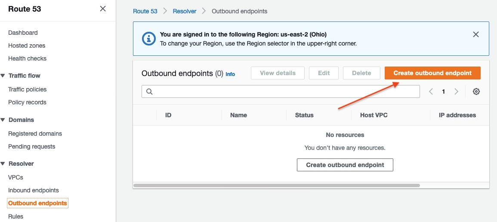

# (AWS 측) Rout 53 리졸버 설정

Route 53 리졸버는 전체 하이브리드 클라우드에서 원활한 DNS 쿼리 확인을 지원하여 기업 고객이 하이브리드 클라우드를 더 쉽게 사용할 수 있도록 합니다. DNS 엔드포인트와 조건부 전달 규칙을 생성하여 온프레미스 데이터 센터와 AWS VPC 간의 DNS 네임스페이스 확인을 허용할 수 있습니다.

시뮬레이션된 온프레미스 데이터센터에는 모든 내부 애플리케이션 호스트가 등록된 example.corp 도메인에 대해 권한 있는 이름 서비스를 제공하는 DNS 서버가 있습니다. 완벽한 하이브리드 연결 솔루션을 제공하기 위해 AWS VPC의 호스트가 데이터센터 환경의 호스트 이름을 확인할 수 있도록 하려고 합니다. 이는 Route 53 리졸버와 example.corp 도메인에 대한 조건부 전달 규칙을 사용하여 달성할 수 있으며, AWS 인스턴스가 VPC 및 인터넷 내부의 다른 모든 이름 확인을 위해 고가용성 Amazon DNS 서비스를 계속 활용할 수 있도록 합니다.

이 실습에서는 AWS 환경에서 시뮬레이션된 데이터 센터로 DNS 확인을 설정하는 데 중점을 두지만, 그 반대도 가능하다는 점에 유의하십시요. Route 53 리졸버는 온프레미스 DNS 서버에서 조건부로 전달되는 인바운드 DNS 쿼리를 지원합니다. 인바운드 DNS 확인에 대한 자세한 내용은 AWS 설명서 에서 확인할 수 있습니다. (시간이 허락하면 이 사항도 실습하도록 하겠습니다)

## 1. Route 53 리졸버 아웃바운드 엔드포인트 설정

Route 53 리졸버는 엔드포인트를 사용하여 외부 DNS 서버와 통신합니다. 엔드포인트는 기존 DNS 서버에 연결할 수 있는 VPC 내부에 배치된 ENI (Elastic Network Interface)입니다. DNS 서버는 EC2 인스턴스에서 실행되는 DNS 서버일 수도 있고, 직접 연결 또는 VPN을 통해 액세스할 수 있는 온프레미스에서 실행되는 DNS 서버일 수도 있습니다. AWS 환경의 세 VPC 모두 Transit Gateway를 통해 시뮬레이션된 데이터센터에 연결할 수 있으므로 이 중 하나의 VPC를 엔드포인트 생성에 사용할 수 있습니다. 엔드포인트는 고가용성을 위해 선택한 VPC에서 최소 2개의 가용성 영역에 인터페이스를 생성합니다.

1. "Route 53"으로 이동하여 "Resolver" 아래에서 "Outbound endpoints"를 선택합니다.

2. "Create outbound endpoint"를 클릭합니다.
    

3. 아웃바운드 엔드포인트에 대한 설정을 다음과 같이 구성합니다:
   - 엔드포인트 이름: 이 아웃바운드 엔드포인트의 고유한 이름을 선택합니다(예: ```ImmersionDay-Out```). 
   - VPC: AWS 환경에서 VPC A를 선택합니다. 
   - 보안 그룹: 아웃바운드 연결을 허용하는 규칙이 이미 포함되어 있는 CDK와 함께 배포된 보안 그룹을 선택합니다.
     - (예) ```DC2AWS-Ec2Stack-0-``` 이름으로 시작하는 보안 그룹 
   - 엔드포인트 타입: ```IPv4```
   - IP 주소 #1:
     - 가용 영역: 작업 중인 지역에서 첫 번째 AZ를 선택합니다 (예: ap-northeast-2a). 
     - 서브넷: A존의 Private Subnet을 선택합니다 (예: DC2AWS-NetworkStack-0/DC2AWS-NetworkStack-0-Privateubnet-a) 
     - IP 주소: 자동으로 선택된 IP 주소를 사용합니다. 
   - IP 주소 #2:
     - 가용 영역: 작업 중인 지역에서 두 번째 AZ를 선택합니다 (예: 우리는 C존에 두번째 서브넷을 배치하였으므로 ```ap-northeast-2c```를 선택합니다). 
     - 서브넷: C존의 Private Subnet을 선택합니다 (예: DC2AWS-NetworkStack-0/DC2AWS-NetworkStack-0-Privateubnet-c)
     - IP 주소: 자동으로 선택된 IP 주소를 사용합니다.

    결과적으로 다음과 같은 화면으로 표시되며, "Submit"을 눌러 엔드포인트를 생성합니다.<br>
    

4. 엔드포인트 상태가 "Operational"로 변경될 때까지 기다립니다. 그런 다음 다음 단계로 진행합니다.<br>
    

## 2. example.corp를 위한 Route 53 리졸버 규칙 생성

이제 아웃바운드 엔드포인트를 만들었으므로 Route 53 Resolver는 ```VPC 0```와 트랜짓 게이트웨이의 VPN 연결을 통해 데이터센터 DNS 서버에 도달할 수 있습니다. 다음으로, ```example.corp```에 대한 쿼리를 해당 DNS 서버로 보내도록 Route 53 Resolver 규칙을 구성해야 합니다. 이 규칙을 VPC의 0, 1, 2에 연결하면 VPC DNS Resolver가 이 세 VPC 중 하나에 있는 인스턴스의 쿼리를 처리할 때마다 Route 53 Resolver가 이 규칙을 사용하게 됩니다.

1. Route 53 콘솔에서 "Resolver" 섹션의 "Rules" 탭으로 이동합니다.

2. "Create rule"을 선택합니다.<br>
    

3. 아래와 같이 Rule을 생성하기 위한 정보를 입력합니다:<br>
    - Unique한 이름을 지정합니다. 예) ```NetworkImmersionDay-rule```
    - 도메인 이름에 ```example.corp```를 지정합니다. 
    - 규칙을 세 개의 AWS VPC 모두와 연결합니다: VPC 0, VPC 1, VPC 2
    - 이전 단계에서 만든 아웃바운드 엔드포인트를 선택합니다.
    - 대상 IP 주소에 대해 데이터센터 DNS 서버의 IP 주소를 입력합니다 (데이터센터 담당 동료로부터 확인)

    <br>
    <br>

    - "Submit"을 눌러 Rule을 생성합니다.

## 3. Route 53 Resolver Rule 테스트


AWS VPC의 0, 1 또는 2 중 하나에서 example.corp 도메인에 대한 쿼리를 데이터센터의 DNS 서버로 전달하도록 Route 53 Resolver를 구성했습니다. AWS VPC의 EC2 인스턴스 중 하나에서 온프레미스 앱 서버에 연결을 시도하여 이름 확인을 테스트할 수 있습니다.

1. EC2 콘솔에서 연결 옵션을 사용하여 VPC 0, VPC 1 또는 VPC 2의 EC2 인스턴스 중 하나에 연결합니다 ("세션 관리자" 사용).

2. ```resolv.conf```를 검토하여 인스턴스의 DNS 서버 설정을 확인합니다:

    ```bash
    cat /etc/resolv.conf
    ```

3. AWS 클라우드의 VPC내에 위치한 인스턴스는 이름 확인을 위해 온프레미스 DNS 서버가 아닌 AWS 제공 DNS 서버 (예: 10.0.0.2)를 사용한다는 점에 주목하세요:

    

    ```bash
    ; generated by /usr/sbin/dhclient-script
    search ap-northeast-2.compute.internal
    options timeout:2 attempts:5
    nameserver 10.0.0.2
    ```

4. 온프레미스 애플리케이션 서버의 호스트 이름 (myapp.example.corp)을 사용하여 CURL로 접속이 되는지 테스트해 봅니다.
    ```bash
   curl http://myapp.example.corp
    ```
    이름 확인 및 애플리케이션 서버가 정상적으로 작동하는 경우 "Hello, world"라는 응답을 받게 됩니다.<br>
   
