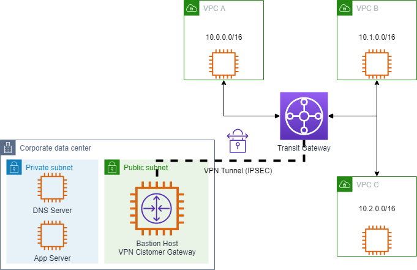

# (AWS 측) AWS에서 데이터센터 네트워크로 VPN 접속 테스트

이제까지 구성한 사항을 간략하게 그려보면 다음과 같습니다.<br>


이제 VPN 터널이 가동되었으므로 Transit Gateway를 통해 AWS 환경에서 시뮬레이션된 온프레미스 환경으로의 연결을 테스트할 수 있습니다. 온프레미스 환경에는 애플리케이션 서버와 DNS 서버가 있다는 점을 기억하십시요. 애플리케이션 서버는 온프레미스 DNS 서버에 myapp.example.corp 호스트 이름에 대한 DNS A 레코드가 있습니다. 이 섹션에서는 AWS와 시뮬레이션된 데이터센터 환경 간의 연결을 확인하고 애플리케이션 서버에 연결할 수 있는지 테스트합니다.

1. ```EC2 콘솔```에서 VPC 0, 1, 혹은 2에 위치한 인스턴스 중 하나에 접속합니다. (세션 매니저 활용)<br>
2. 어플리케이션 서버에 curl을 사용하여 테스트합니다.
    ```bash
   curl http://myapp.example.corp
    ```

    > (참고)
    > 이 작업은 실패합니다. AWS 인스턴스가 데이터센터의 DNS 서버에 호스팅된 이름을 확인할 수 있도록 DNS가 아직 구성되지 않았기 때문에 "호스트를 확인할 수 없습니다"라는 오류 메시지가 표시됩니다. 다음 섹션에서 하이브리드 DNS를 다루겠습니다.

    

3. 어플리케이션 서버의 Private IP 주소를 사용하여 다시 시도합니다. 해당 IP 주소는 데이터센터를 설정하신 동료분으로부터 얻을 수 있습니다.<br>

    ```bash
   curl http://<APP SERVER PRIVATE IP>
    ```
   VPN 연결이 올바르게 작동하는 경우, 이 명령은 애플리케이션 서버에서 "Hello, world."를 반환합니다.<br>
    

4. 마지막으로, AWS EC2 인스턴스가 온프레미스 DNS 서버에 직접 쿼리할 때 연결할 수 있는지 확인해 보겠습니다. 데이터센터 DNS 서버의 IP 주소를 동료분으로터 전달 받습니다.

5. ```dig``` 명령을 통해 ```myapp.example.corp``` 이름을 질의합니다.<br>

    ```bash
   dig @<DNS SERVER PRIVATE IP> myapp.example.corp
    ```
   쿼리는 다음과 유사하게 온프레미스 애플리케이션 서버에 대한 A 레코드를 반환해야 합니다:

    

---

