# TravelBuddy 컨테이너화하기
앞서 우리가 CDK를 배포한 자원에는 EKS 클러스터와 더불어 빌드 및 전달 (Build and Delivery) 파이프라인도 포함되어 있습니다.

우리는 이 파이프라인을 통해 TravelBuddy를 빌드하고 컨테이너화 (Containerize)하여 AWS의 컨테이너 레지스트리 서비스인 ECR (Elastic Container Registry)의 리포지터리로 전달할 예정입니다.

TravelBuddy 어플리케이션은 이미 Java와 Maven을 빌드 체계를 제공하므로, 우리는 애플리케이션을 빌드하는 새로운 Scheme을 구성하는 대신 기존의 빌드 툴인 Maven을 이용하면서 컨테이너화 하는 것에만 집중하여 실습을 진행합니다.

## Agenda
- 준비하기
- TravelBuddy 프로젝트 살펴보기
- 바이너리 및 컨테이너 이미지 빌드하기
- ECR에 이미지 푸시하기

## 준비하기
1. 먼저 어플리케이션의 소스 리포지터리를 확인합니다. 이 리포지터리에 소스 코드가 푸시되면 빌드 및 전달 파이프라인이 트리거되어 소스 코드를 빌드하고 이로부터 컨테이너 이미지를 생성합니다. 그리고 생성된 컨테이너 이미지를 ECR 리포지터리에 푸시합니다.
   1. CodeCommit > "M2M-BuildAndDeliveryStack-SourceRepository"
   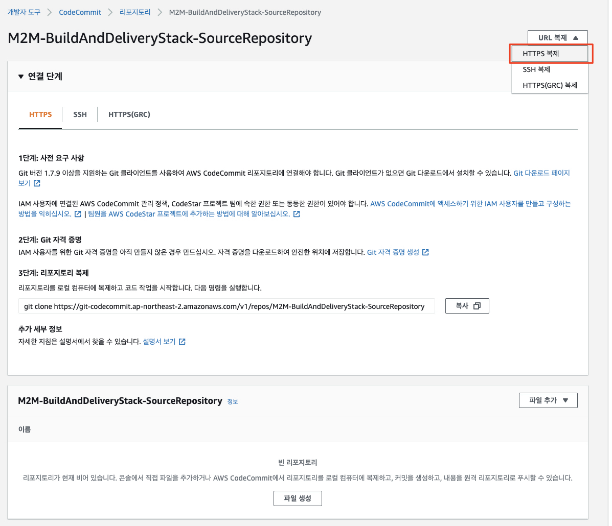
   2. 위 그림과 같이 "HTTPS 복제"를 클릭하여 Git 리포지터리 주소를 클립보드에 복사합니다.
2. TravelBuddy 소스 코드를 CodeCommit 리포지터리에 연결
   1. (참고) 우리는 이미 실습 가이드 및 소스 코드 전체를 가진 Git Repository 내에서 작업하고 있으므로 아래와 같이 서브 디렉토리 (어플리케이션 소스 코드)를 또 다른 Git Repository로 연결하면 Git 관리에 다소 혼란이 생길 수 있습니다. 하지만 전체 Git 경로는 추가적인 Git 관리 작업이 없음을 가정하고 이렇게 수행하도록 합니다.
   2. (참고) Git으로 관리되는 리포지터리의 하위 디렉토리를 또 다른 Git 리포지터리와 연계하는 대표적인 방법은 Git Submodule 기법을 활용하는 것입니다. 이에 대해서는 다음을 참고하십시요 - [Git Submodule (from Atlassian)](https://www.atlassian.com/git/tutorials/git-submodule) /  [7.11 Git Tools - Submodules](https://git-scm.com/book/en/v2/Git-Tools-Submodules)
```bash
# 1. 소스 경로로 이동
cd ~/environment/m2m-travelbuddy/applications/TravelBuddy/build/

# 2. git 연결
git init
git branch -M main
git remote add origin <1에서 복사한 CodeCommit Git 리포지터리 주소>
# (예)
# git remote add origin https://git-codecommit.ap-northeast-2.amazonaws.com/v1/repos/M2M-BuildAndDeliveryStack-SourceRepository

# 3. Git 스테이징 영역에 파일을 추가합니다.
git add .

# 4. Commit 및 Push합니다.
git commit -am "First commit."
git push --set-upstream origin main
```

3. CodeCommit 리포지터리에 소스 코드가 푸시되었음을 확인합니다.<br>
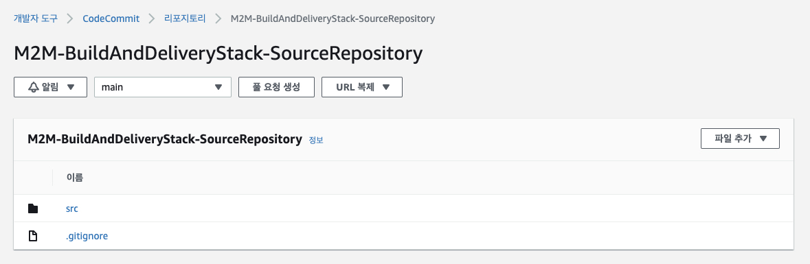

4. 또한 빌드 파이프라인도 트리거되어 실행되었음을 확인합니다. 다만, Build Spec이 없거나 정상적으로 구성되지 않은 등의 이유로 파이프라인은 실패하였을 수 있습니다.
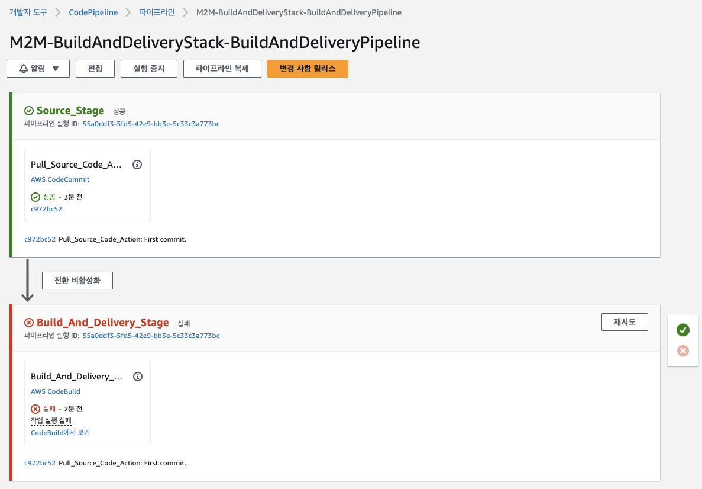<br>
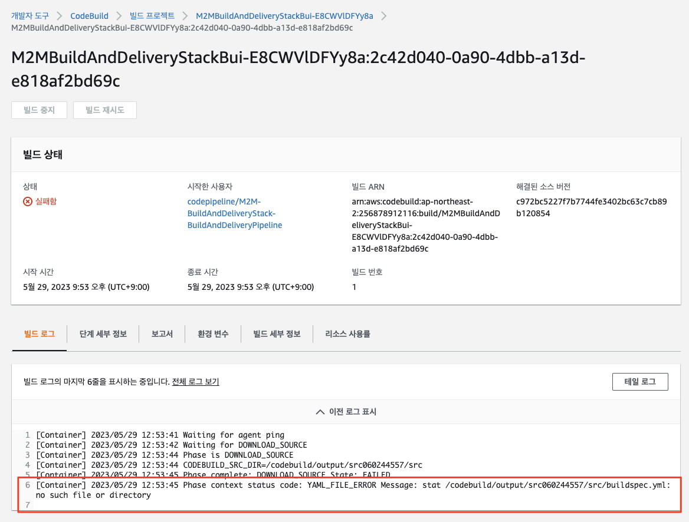

우리는 여기서 잠깐 멈추고 프로젝트를 살펴봄으로써 빌드 파이프라인에서 필요로 하는 Build Spec을 어떻게 구성할지 단서를 얻도록 하겠습니다.   

---

우리는 이미 아래 경로에 TravelBuddy 전체 프로젝트 파일을 가지고 있으므로, 이를 살펴보도록 하겠습니다.<br>
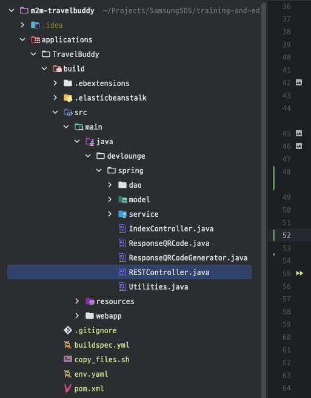

## 프로젝트 살펴보기

먼저 REST API를 구현하고 있는 `applications > TravelBuddy > build > src > main > java > devlounge > spring > RESTController.java`를 살펴봅니다.

`/flightspecials`와 `/hotelspecials` API를 확인할 수 있습니다.

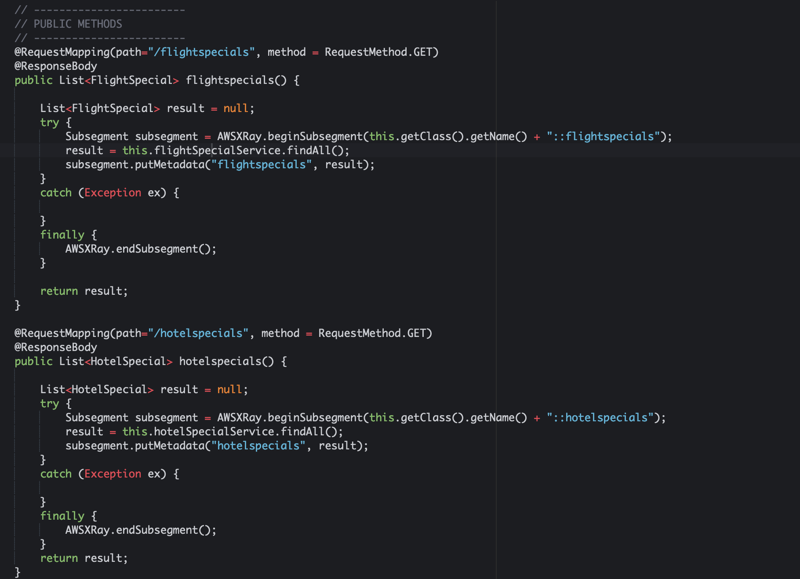

대략 어떤 구조를 가지고 동작하는지 코드를 좀 더 살펴봅니다.

## 빌드하기
이 프로젝트는 Maven을 사용하여 빌드되도록 구성되어 있으며 따라서 컨테이너 이미지를 만들 때에도 이를 고려해야 합니다.<br>
따라서 일반적인 Maven 빌드 과정을 거쳐서 컨테이너 이미지 빌드해 볼 것이며, 이 과정을 로컬에서 (Cloud9) 먼저 수행해 보도록 하겠습니다. 이를 위해 아래와 같이 Dockerfile을 작성해봅니다.

```bash
cd ~/environment/m2m-travelbuddy/applications/TravelBuddy/build
vi Dockerfile
```

```Dockerfile
FROM openjdk:8-jdk

WORKDIR /app
COPY pom.xml .
COPY src /app/src

RUN apt-get update && apt-get install -y wget && \
    wget http://mirror.olnevhost.net/pub/apache/maven/maven-3/3.3.9/binaries/apache-maven-3.3.9-bin.tar.gz && \
    tar xzvf apache-maven-3.3.9-bin.tar.gz -C /opt/

RUN export PATH=/opt/apache-maven-3.3.9/bin:$PATH && \
    mvn -f pom.xml compile war:exploded
```

```bash
# docker 이미지 빌드
docker build -t travelbuddy .

# 파일시스템 탐색을 위한 shell 실행
docker run -it --rm travelbuddy /bin/bash
```

### Multi-stage build 방식으로 TravelBuddy 컨테이너 이미지 빌드하기
위에서 생성한 컨테이너 이미지는 어플리케이션 빌드 과정에만 필요한 (런타임에서는 불필요한) 빌드 도구 (예: Apache Maven 등)이 포함되어 있어 최적화되어 있지 않으며 프로덕션 환경에 적용하기에는 적절하지 않을 수 있습니다.
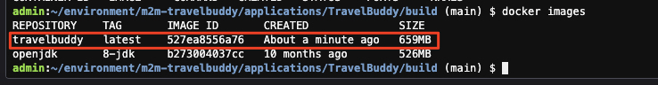

**(도전 과제)**
- Multi-stage 빌드를 
Dockerfile 예시를 확인하기 전에 직접 Dockerfile을 작성하여 컨테이너 이미지를 빌드해보세요.
- 힌트: 아래 두 과정을 하나의 Dockerfile에 작성해 보세요.
  - 과정 1: Maven 베이스 이미지를 사용하여 War 파일을 빌드
  - 과정 2: Tomcat 베이스 이미지를 사용하여 TravelBuddy 컨테이너 이미지 빌드

[//]: # (Dockerfile 예시는 prepare/Dockerfile에 있습니다.)

**(결과 이미지)** <br>
멀티 스테이지를 통해 빌드된 컨테이너 이미지의 크기는 아래와 같습니다.

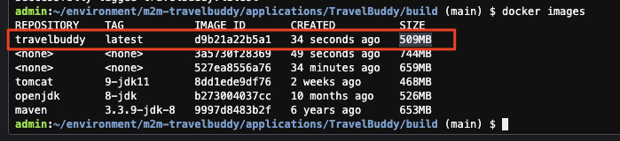

보시다시피 컨테이너 이미지의 크기가 22.3% (659 MB -> 509 MB) 줄어든 것을 확인할 수 있습니다.<br>

***(More Considerations)***
혹시 컨테이너 이미지의 크기를 조금 더 최적화 (크기 축소)할 수 있을까요?

## ECR (Elastic Container Registry)에 이미지 푸시 테스트
ECR에 이미지를 업로드하려면 먼저 리포지터리를 생성해야 합니다. 하지만 앞서 EKS 클러스터를 CDK로 생성하는 과정에서 ECR 리포지터리도 함께 생성되었으므로 따로 생성할 필요는 없습니다.<br>
생성된 ECR 리포지터리는 다음에서 확인할 수 있습니다.<br>
```Amazon ECR > Repositories > m2m-buildanddeliverystack-repository```
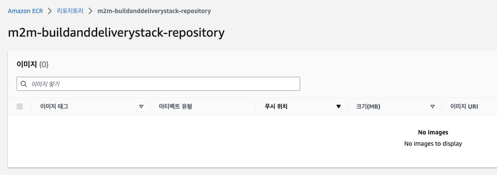

해당 리포지터리에서 클릭한 후 `푸시 명령 보기 (View push commands)` 버튼을 클릭하여 표시되는 가이드대로 Cloud9 터미널에 입력해서 TravelBuddy 이미지를 ECR에 푸시해 봅니다.<br>
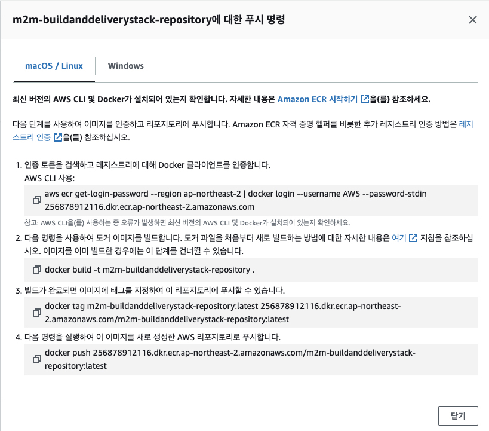
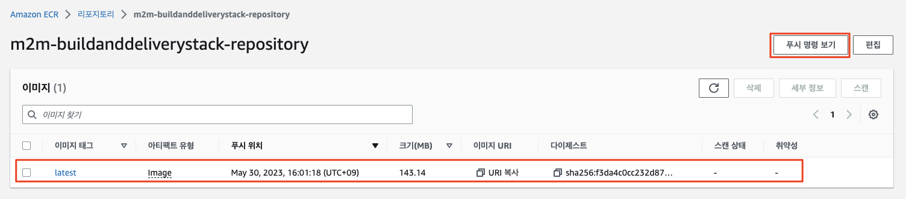

---
## 빌드 및 전달 (Build and Delivery) 파이프라인에 적용

우리는 이제 로컬 (Cloud9)에서 소스를 빌드하고 빌드 결과물을 담은 컨테이너 이미지를 생성한 후 이를 ECR 리포지터리에 푸시하는 것까지 완료하였습니다.<br>
이제 이 과정을 CodeBuild의 Build Spec에 적용하여 소스 코드가 CodeCommit Repository에 푸시되면 자동으로 ECR 리포지터리에 전돨되도록 해보겠습니다.

### 1. Build Spec (buildspec.yml) 파일 작성<br>
- 빌드 및 전달 파이프라인에서 사용하는 빌드 서버 인스턴스 (CodeBuild)는 내부적으로 Build Spec이라는 규약을 사용하여 빌드 과정을 구성할 수 있습니다.
- 궁금하신 분들은 CodeBuild에서 이를 확인할 수 있으며, CDK 소스에서도 마찬가지 사항을 발견하실 수 있을 것입니다.
- 우리는 "buildspec.yml"을 사용하도록 구성하였으므로 이 파일을 앞서 살펴보았던 Multi-stage 전략을 사용, 빌드 및 실행 컨테이너 이미지를 분리하여 생성하고 실행 컨테이너 이미지만을 ECR 리포지터리로 Push하는 것으로 바꾸어 보도록 하겠습니다.

```bash
# 1. 소스 경로로 이동
cd ~/environment/m2m-travelbuddy/applications/TravelBuddy/build

# 2. 기존의 buildspec.yml 파일 백업
mv buildspec.yml buildspec-backup.yml

# 3. Multi-stage 컨테이너 빌드 절차를 가지는 새로운 buildspec.yml 파일 작성
cat > buildspec.yml <<\EOF
version: 0.2
env:
  shell: bash
  git-credential-helper: yes
  variables:
    REGION: "ap-northeast-2"
    IMAGE_TAG_KEY: "/application/travelbuddy/container/image/main/tag"
phases:
  install:
    runtime-versions:
      java: corretto11
    commands:
      - apt-get update
      - apt-get install -y jq
  pre_build:
    commands:
      - echo "Print awscli version"
      - aws --version
      - echo "### SRC_VERISON-> ${CODEBUILD_RESOLVED_SOURCE_VERSION} | Logging-in to ECR"
      - docker login --username AWS -p $(aws ecr get-login-password --region ${REGION}) ${ECR_REPO_URI}
      - export TAG=${CODEBUILD_RESOLVED_SOURCE_VERSION}
      - export TAG=$(echo $TAG | sed -e "s/\.//g"| tr '[:upper:]' '[:lower:]')
      - export TAG=$(echo "${TAG:0:8}")
      - export IMAGE_TAG="${TAG}"
      - echo "## TAG-> ${TAG}"
  build:
    commands:
      - |
        echo "### Building Container Image ###"
        echo $CODEBUILD_SRC_DIR
        echo Build started on `date`
        echo Building the Docker image...
        docker build -t $ECR_REPO_URI:latest ./
        docker images
        docker tag $ECR_REPO_URI:latest $ECR_REPO_URI:$IMAGE_TAG
      - |
        echo "### Pushing Container Image ###"
        docker push $ECR_REPO_URI:latest
        docker push $ECR_REPO_URI:$IMAGE_TAG
  post_build:
    commands:
      - |
        echo "### Pushing container image tag to SSM for reuse ###"
        aws ssm put-parameter --name $IMAGE_TAG_KEY --value $IMAGE_TAG --type String --region $REGION --overwrite
      - echo "${IMAGE_TAG}" >> build_output.txt
artifacts:
  files:
    - build_output.txt
cache:
  paths:
    - '/root/.gradle/caches/**/*'
EOF
```
### 2. 어플리케이션 소스 푸시 및 빌드 시작<br>
1. 다음과 같이 어플리케이션 소스를 푸시하면 빌드 및 전달 파이프라인이 시작됩니다.
```bash
git add .
git commit -am "[Modified] buildspec.yml to build source and deliver to ECR repository." && git push
```
2. 빌드 및 전달 파이프라인 시작<br>
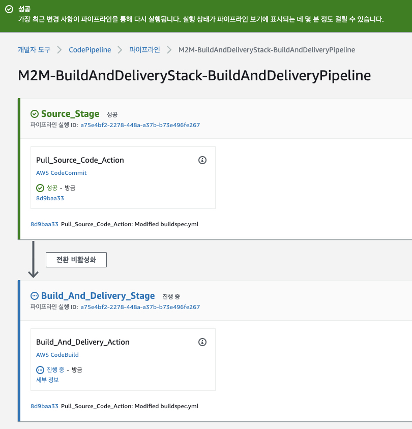

3. 컨테이너 이미지가 정상적으로 ECR 리포지터리에 푸시됨<br>
   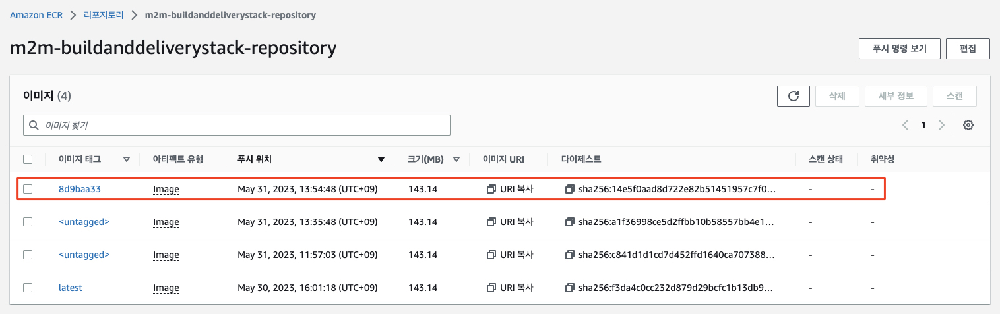

---

축하합니다!<br>
이제 TravelBuddy의 레거시 어플리케이션을 빌드 및 전달 파이프라인 상에서 빌드하고 컨테이너 레지스트리에 푸시하는 구성을 완셩하였습니다.<br>
우리는 어플리케이션의 구조 변경을 시작하는 것이 목적이므로 CI/CD 파이프라인에 오래 머물지 않고 다음 사항인 데이터베이스 연결과 EKS 배포를 해봄으로써 모놀리스 어플리케이션을 클라우드 쿠버네테스 상에서 동작시켜 보도록 하겠습니다.
