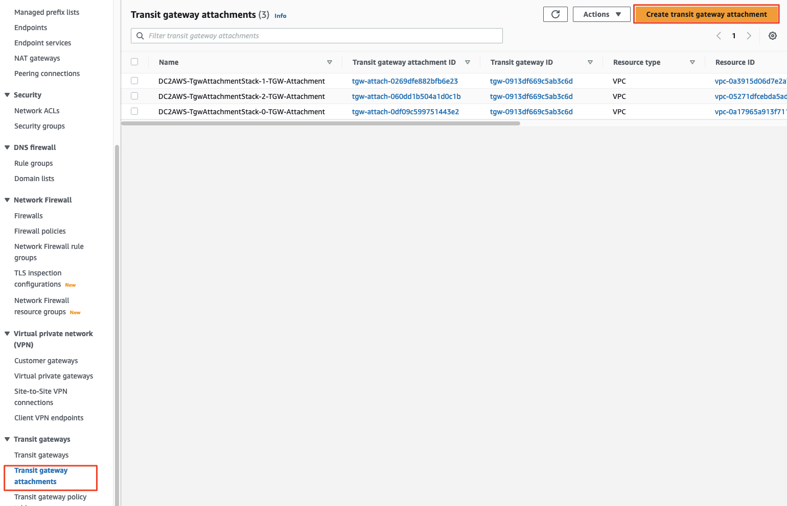
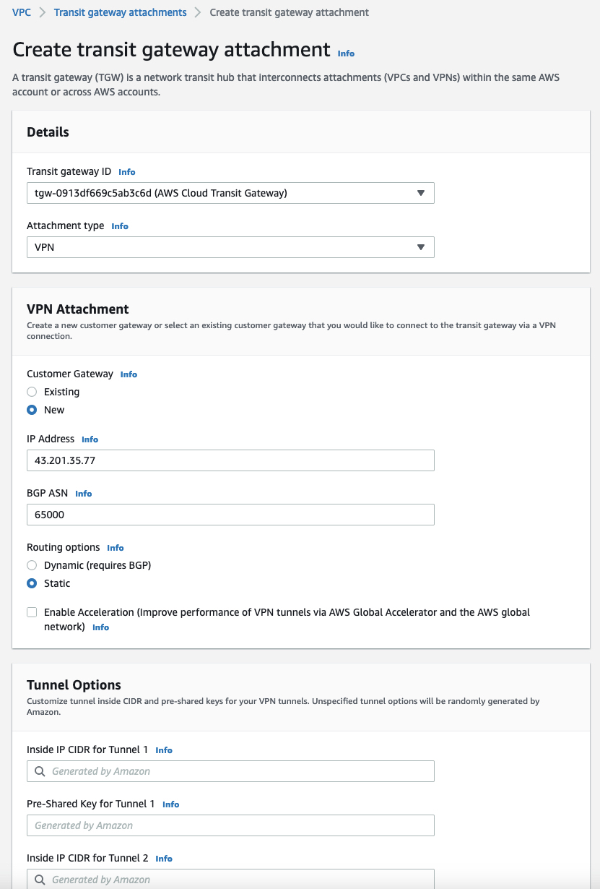
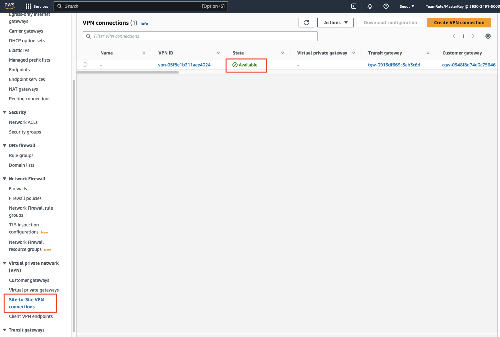
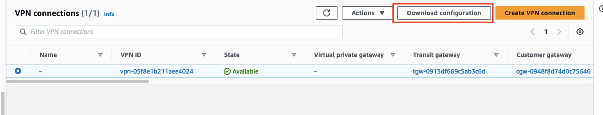
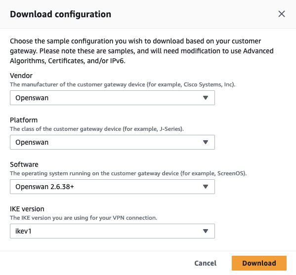
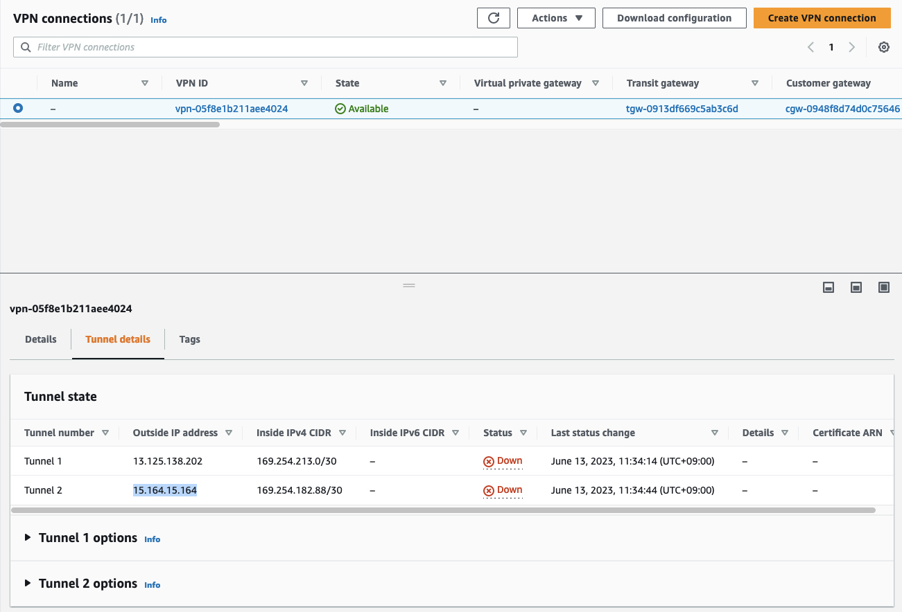
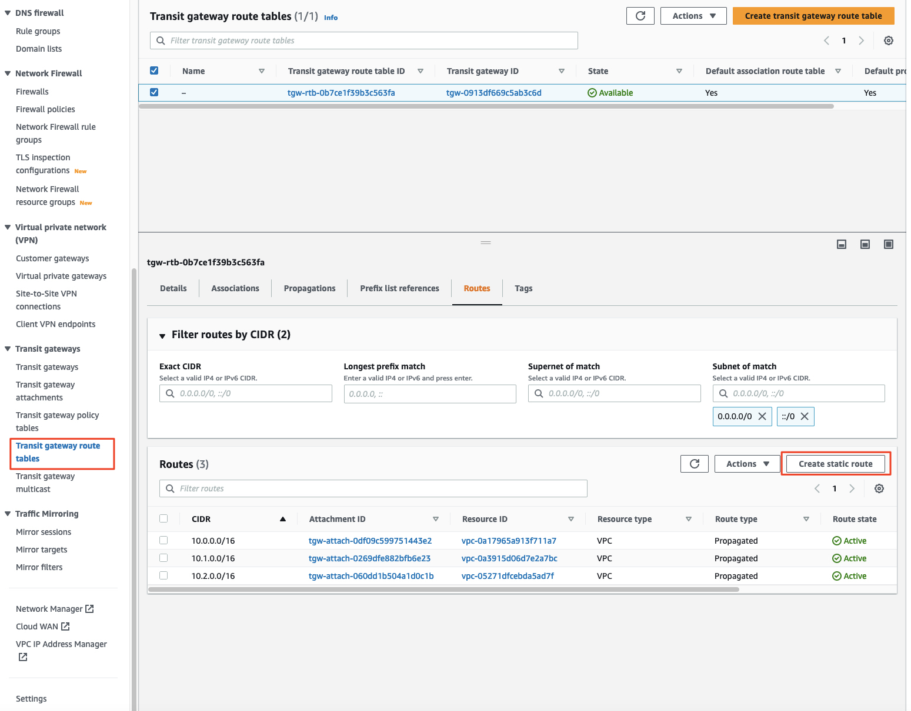
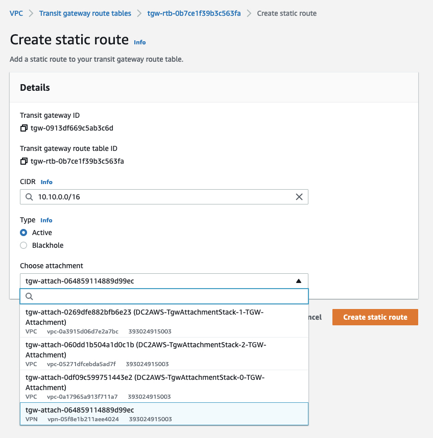
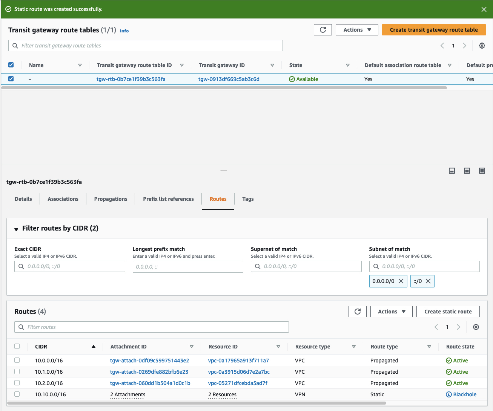

# (AWS 측) 고객 게이트웨이 (Customer Gateway) 생성

AWS 클라우드 쪽에서 아래 순서로 수행하여 고객 게이드웨이와 Transit Gateway Attachment를 생성합니다.

1. [VPC 대시보드 - Transit Gateway Attachment](https://console.aws.amazon.com/vpc/home?#TransitGatewayAttachments:sort=transitGatewayAttachmentId)로 이동하여 "Create Transit Gateway Attachment"를 클릭합니다.<br>
  

2. Attachment 유형으로 ```VPN```을 선택하고, "Customer Gateway"을 새롭게 생성하도록 지정합니다. 
   - (중요) IP 주소에는 데이터센터에서 생성된 Bastion 호스트의 주소를 입력합니다. (데이터센터를 맡으신 분께 요청)
   - Routing 옵션으로 ```Static```을 선택합니다.
   - 다른 설정값들은 기본값을 사용합니다.
   - "Create attachment"를 클릭합니다.<br>
   

3. AWS 콘솔에서 [Site-to-Site VPN 연결](https://console.aws.amazon.com/vpc/home?#VpnConnections:sort=VpnConnectionId)을 선택하고, 새롭게 생성된 VPN 연결이 ```Available``` 상태로 전환될 때까기 기다립니다.<br>
    <br>

4. VPN 연결이 ```Available``` 상태로 전환되면, "Download configuration"을 선택하고 Vendor 선택 콤보박스에서 "Openswan"을 선택합니다.
    <br>
    
   - ```Download``` 버튼을 눌러 파일을 저장해 둡니다. 이 파일은 데이터센터 VPN 장비 (Bastion 호스트)에서 VPN 구성을 수행할 때 필요합니다.

5. ```Site-to-Site VPN 연결``` 화면에서 터널 세부 정보 탭을 선택합니다. 두 터널의 "외부 IP 주소"를 기록해 두세요. 나중에 시뮬레이션된 데이터센터 환경의 보안 그룹을 설정할 때 참조할 수 있습니다.<br>
    

6. VPN 연결에 정적 라우팅을 사용하고 있으므로 데이터센터 네트워크에 대한 경로를 수동으로 생성해야 합니다.

7. [VPC console - Transit Gateway Route Tables](https://console.aws.amazon.com/vpc/home?#TransitGatewayRouteTables:sort=transitGatewayRouteTableId)에서 Transit Gateway의 기본 경로 테이블이 선택되어 있는지 확인한 다음 하단 창에서 "Routes" 탭을 선택합니다. "Create static route"을 클릭하여 새 정적 경로를 추가합니다.<br>
    

8. 시뮬레이션된 데이터 센터 환경 ```10.10.0.0/16```에 대한 CIDR 블록을 입력하고 위에서 생성한 VPN Attachment를 선택한 후, ```Create static route```를 클릭합니다.
    <br>
    <br>
