# Database Setup

## Agenda

- RDS MySQL 인스턴스 생성
- Bastion Host 프로비저닝
- 인스턴스에 IAM Role 부여하기
- MySQL 설정하기
  - Cloud9에서 Bastion 호스트에 접속
  - MySQL 클라이언트 설치하기
  - RDS 접속 및 데이터베이스 초기 구성

## RDS MySQL 인스턴스 생성
RDS 인스턴스는 CloudFormation을 이용하여 배포합니다.

CloudFormation 콘솔로 이동하여 `Create stack` > `With new resources (standard)`를 클릭하여 Create stack 화면으로 진입합니다.

Prepare template는 `Template is ready`를 선택하고, Specify template에서 `Upload a template file`을 선택한 후, `Choose file` 버튼을 클릭하여 [prepare/rds.template](../prepare/rds.template) 파일을 업로드합니다.

Specify stack details 화면이 나타나면, Stack name으로 `TravelBuddyRds`를 입력하고, PrivateSubnetIds에는 EKS 클러스터의 private subnet 두 개를 선택합니다. VpcId에는 EKS 클러스터의 VpcId를 선택합니다.

Next를 클릭해서 RDS를 생성합니다.

## Bastion Host 프로비저닝

RDS에는 Public Access가 불가하기 때문에, RDS 설정을 위한 Bastion Host가 필요합니다.<br>
(사실 현재 사용하고 있는 Cloud9이 위치한 VPC와 Peering으로 연결하여 바로 접근 가능하지만, 그것보다는 Bastion Host를 따로 설정해 봅니다)

아래 그림과 같이 Bastion 호스트의 이름을 입력합니다. (eg. RDS-Bastion 혹은 간단하게 bastion)
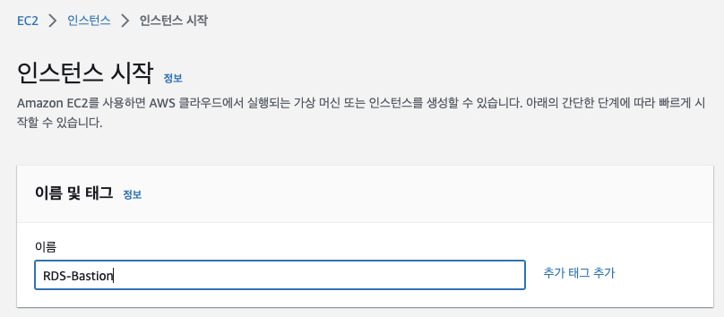

AMI는 `Amazon Linux 2023 AMI`를 선택합니다.
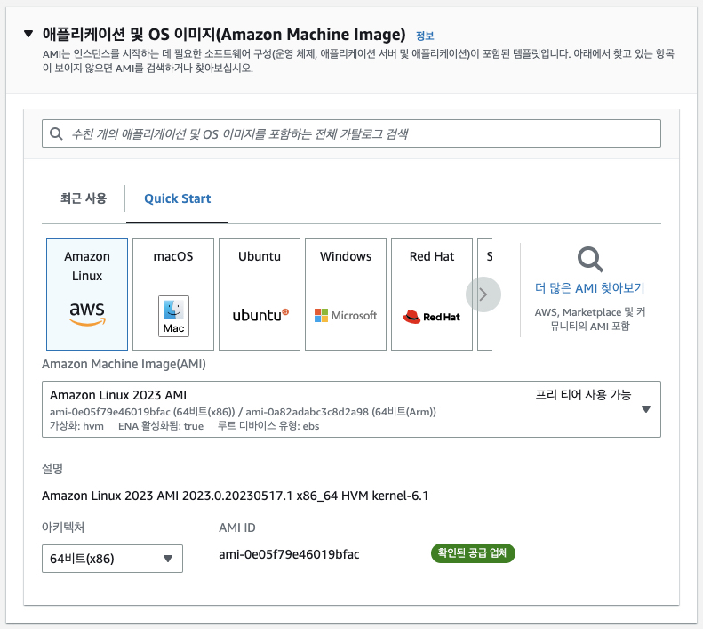

인스턴스 타입은 `m5.large`을 선택합니다.
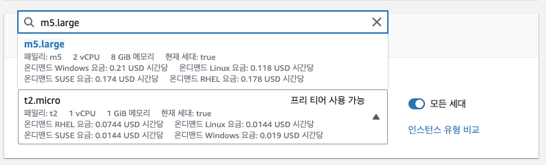

실습에서는 `Create new key pair`를 클릭하여 새로운 키를 생성한 후 이를 사용합니다. 로컬에 다운로드된 Private Key 파일은 잘 보관합니다.<br>
(참고) 우리는 실습 환경에서 Putty나 SSH를 사용하기가 용이하지 않으므로, SSM Session Manager를 통해서 접속할 예정입니다. 하지만 만약을 위해 Private Key를 생성하고 다운받기로 합니다.
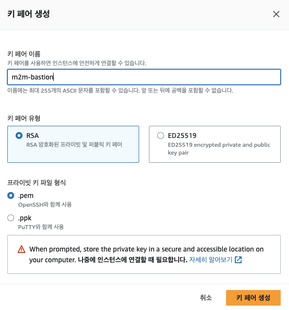
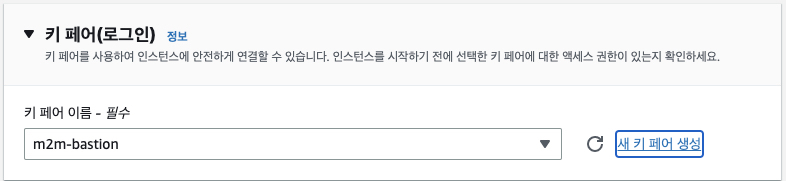

네트워크 설정은 이전 단계에서 생성한 EKS 클러스터와 동일한 VPC를 선택하고, 서브넷으로는 Public 서브넷 중 하나를 선택합니다.
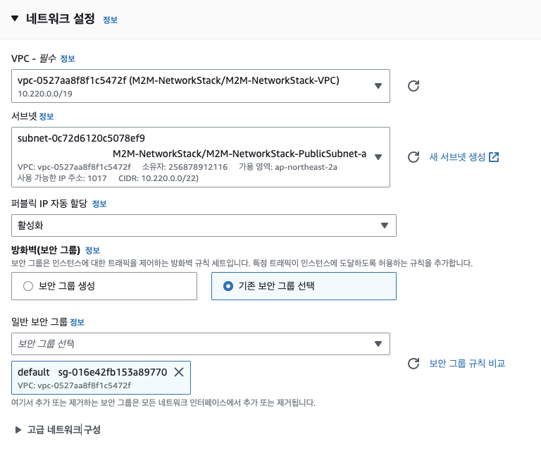

스토리지는 컨테이너 빌드 등에 활용하기 위해서 30GB로 설정합니다.
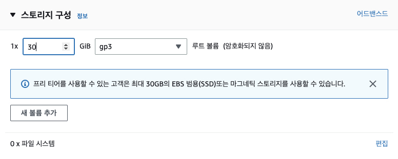

요약 내용을 확인한 후 `인스턴스 시작 (Launch instance)` 버튼을 클릭하여 인스턴스를 시작합니다.
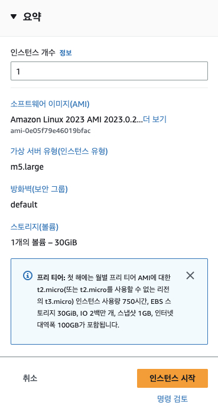

## 인스턴스에 IAM Role 부여하기

EC2 콘솔에서 위에서 생성한 bastion 호스트 인스턴스를 선택 후, Actions > Security > Modify IAM Role을 클릭합니다.
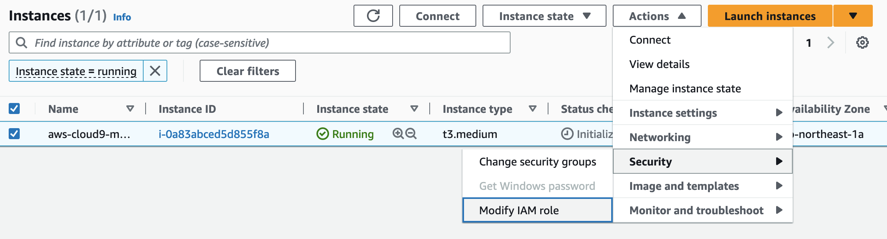

IAM Role에서 m2m-admin을 선택한 후, Save 버튼을 클릭합니다.
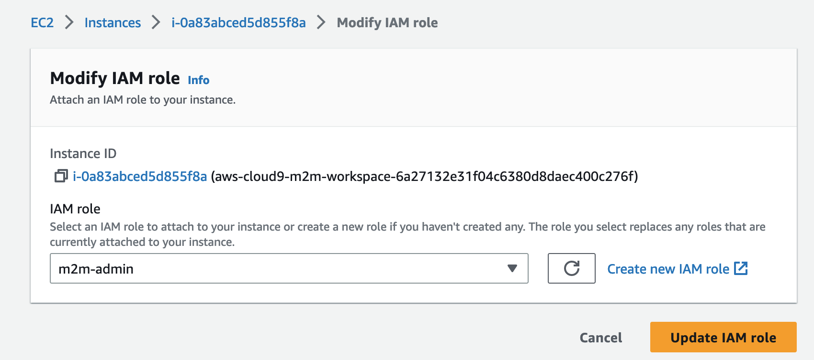

## MySQL 설정하기

### Cloud9에서 bastion 호스트에 접속

Cloud9에서 `File > Upload Local Files...`를 선택하여 이전 단계에서 다운로드한 key 파일을 업로드합니다.
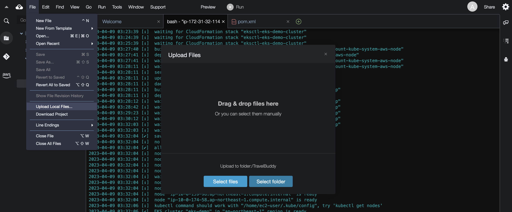

다음과 같이 업로드한 key 파일의 권한을 변경합니다.

```bash
chmod 400 m2m-bastion.pem
```

EC2 > Instances로 이동하여, bastion 호스트를 선택한 후 Connect 버튼을 클릭하여 SSH client 접속 명령어를 복사합니다.
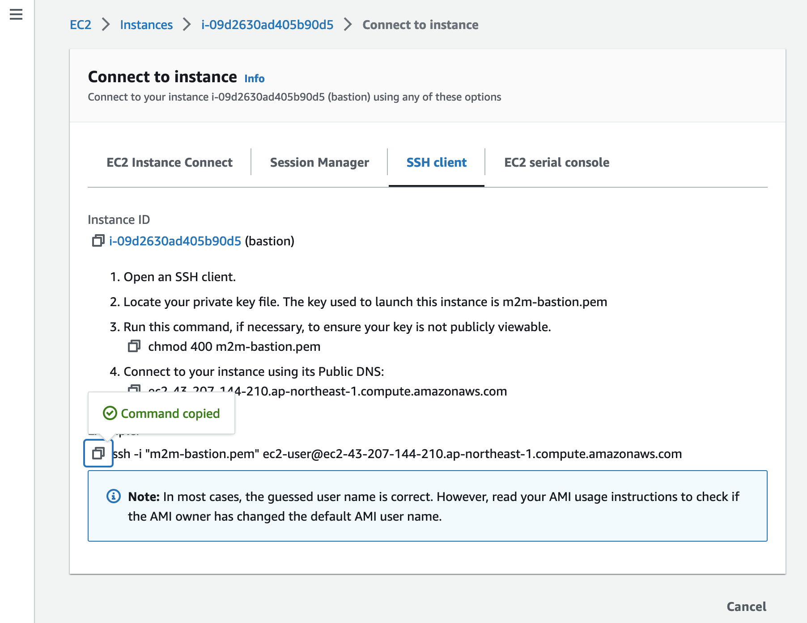

Cloud9 터미널 창에서 아래 예시와 같이 복사한 명령어를 입력하여 bastion 호스트에 접속합니다.

```bash
ssh -i "m2m-bastion.pem" ec2-user@ec2-43-207-144-210.ap-northeast-1.compute.amazonaws.com
```

접속되지 않는 다면 SecurityGroup에 Cloud9의 공인 IP로 SSH 연결을 허용해야 합니다.

다음 명령어로 cloud9의 public IP를 조회합니다.

```bash
curl ifconfig.me
```

EC2 > instances로 이동하여 bastion 호스트를 선택한 후 Security 탭에서 security group을 선택한 후 `Edit inbound rules` 버튼을 클릭하고 아래 위에서 조회한 IP에 대해 SSH 접속을 허용하는 규칙을 추가합니다.

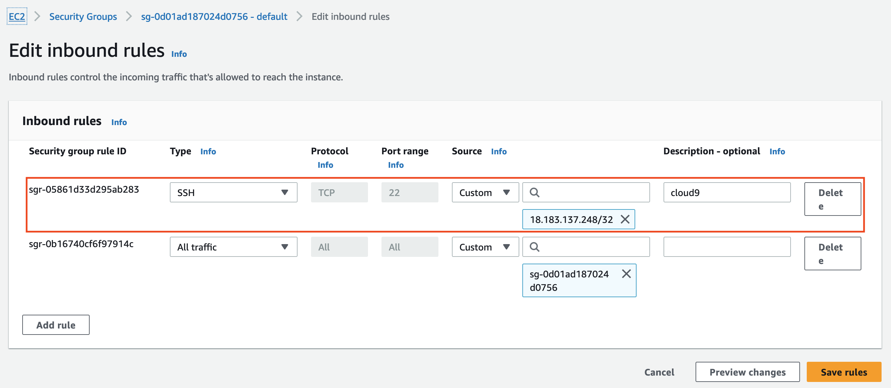

이제 다시 ssh 접속해보면 성공하는 것을 확인할 수 있습니다.

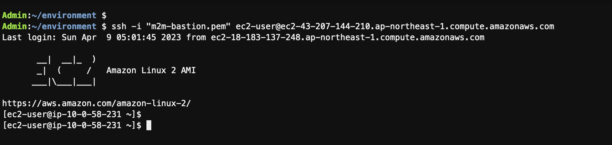

### MySQL 클라이언트 설치하기

```bash
sudo yum -y install mysql
```

### RDS 접속 및 데이터베이스 초기 구성

```bash
mysql -u root --password=labpassword -h <rds_host>
```

접속에 성공하면 다음 명령어로 travelbuddy 데이터베이스를 생성합니다.

```sql
-- Database 생성
CREATE DATABASE travelbuddy;

-- 확인
SHOW DATABASES;
```

Database를 생성한 후 [prepare/dbinit.sql](../prepare/dbinit.sql) 내용을 실행하여 database를 초기화합니다. SQL을 성공적으로 실행한 후 다음과 같이 확인합니다.

```sql
-- Hotel Special 테이블 확인
SELECT * FROM hotelspecial;

-- Flight Special 테이블 확인
SELECT * FROM flightspecial;
```

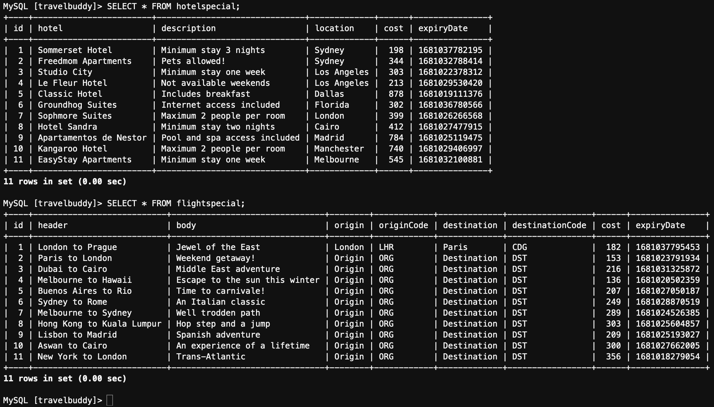

다음 명령어로 mysql client를 종료합니다.

```sql
quit;
```
