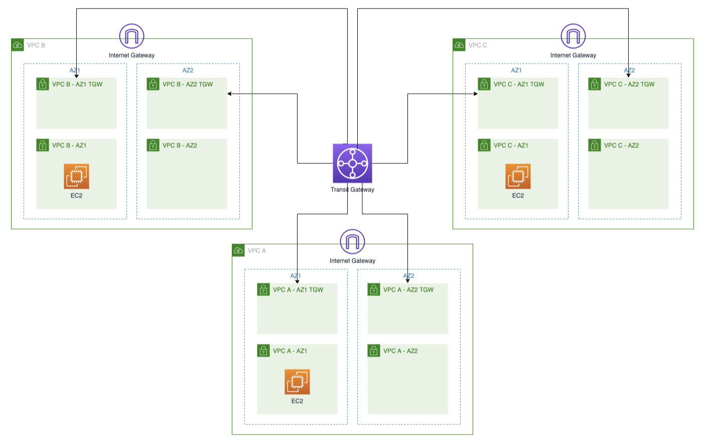

# 데이터센터 환경 구성하기

Amazon 가상 프라이빗 클라우드 (Amazon VPC)는 AWS 관리형 사이트 간(IPsec) VPN 및 다이렉트 커넥트 연결을 포함하여 기존 데이터센터 네트워크를 AWS VPC와 통합할 수 있는 다양한 옵션을 제공합니다. AWS VPN 연결은 터널당 최대 1.25gbps의 처리량을 제공합니다. 트랜짓 게이트웨이와 함께 사용할 경우, AWS VPN은 ECMP(동일 비용 다중 경로)를 지원하여 VPN 처리량을 확장할 수 있습니다.

이번에 구성할 내용은 시뮬레이션된 데이터센터 환경을 설정하고, 다른 동료분이 [AWS 클라우드 환경 구성하기](./aws-cloud-setup.md)에서 설정한 기존 Transit Gateway와 연결하겠습니다. VPC는 Transit Gateway를 사용하여 상호 연결되었습니다.



## Agenda

시뮬레이션된 데이터 센터 환경을 구축하여 AWS 환경에 연결합니다.<br>
- DNS 서버 및 간단한 웹 애플리케이션과 함께 시뮬레이션된 데이터센터 환경을 포함하는 VPC를 배포합니다.
- 시뮬레이션된 데이터센터와 AWS 환경 간에 VPN 연결을 설정합니다.
- AWS 환경과 시뮬레이션된 데이터센터 간에 DNS 확인을 설정합니다.
- AWS 환경에서 시뮬레이션된 데이터센터로의 연결을 테스트합니다.

## 시뮬레이션된 데이터센터 환경 생성

1. CloudFormation 템플릿 실행

이제 시뮬레이션된 온프레미스 환경을 위해 제공된 CloudFormation 템플릿을 배포할 준비가 되었습니다. 이 스택은 퍼블릭 및 프라이빗 서브넷이 포함된 1개의 VPC와 Bastion 호스트, DNS 서버, 애플리케이션 서버를 위한 3개의 EC2 인스턴스를 생성합니다.

* CloudFormation 템플릿 다운로드: [데이터센터용 CloudFormation 템플릿](../templates/Basic-Lab2-On-prem-simulator.yaml)
* 다운로드한 CloudFormation 템플릿을 실행하여 자원을 아래와 같이 생성합니다.
  - 이름
  ```bash
    Network-Immday-DC
  ```
  - InstanceType
  ```bash
  t3.2xlarge
  ```
  - 이외의 값들은 기본값을 수락하고 "다음"을 클릭하여 생성합니다.<br>


2. 데이터센터 환경 둘러보기<br>

이제 Bastion 호스트, 웹 애플리케이션 서버, DNS 서버로 구성된 시뮬레이션된 데이터센터 환경을 시작했습니다. 이 환경을 AWS 환경에 연결하기 전에 구성 요소가 제대로 작동하는지 확인해 보겠습니다.<br>

- EC2 콘솔에서 연결 옵션을 사용하여 이름에 OnPremBastion-을 사용합니다(예: "세션 관리자" 사용).
<br>
<br>

- ```etc/resolv.conf``` 파일을 확인하여 인스턴스가 VPC 기본값 대신 사용자 지정 DNS 서버를 사용하고 있는지 확인합니다.
  ```bash
  cat /etc/resolv.conf 
  ```
  

  "nameserver" 줄에 주목하세요. 이 줄은 위의 CloudFormation 스택 출력에서 확인한 DNS 서버의 IP 주소를 가리키고 있어야 합니다.<br>

- 애플리케이션 서버를 테스트합니다. 시뮬레이션된 데이터센터 환경에서는 내부 도메인 이름 "example.corp"를 사용하고 애플리케이션 서버에는 "myapp.example.corp"에 대한 호스트 이름 항목이 있습니다. curl 명령을 사용하여 애플리케이션 서버가 실행 중인지 테스트할 수 있습니다:
  ```bash
  curl http://myapp.example.corp
  ```
  애플리케이션 서버가 제대로 작동하는 경우 ```Hello, world.```라는 응답이 표시됩니다.<br>
  <br>
  이제 시뮬레이션된 온프레미스 데이터센터의 기능을 확인했으므로 VPN 연결을 사용하여 트랜짓 게이트웨이에 연결해 보겠습니다.

