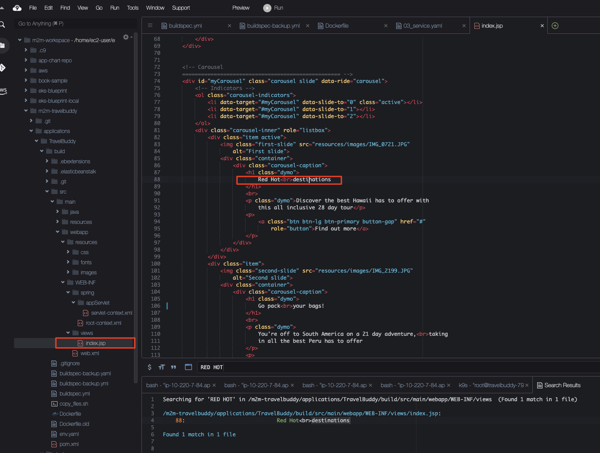

# TravelBuddy 애플리케이션을 EKS에 배포

## Agenda

1. Bastion 호스트에 접속해서 TravelBuddy 애플리케이션 실행해보기 
   1. Docker 설치 
   2. TravelBuddy 컨테이너 실행
2. EKS에 배포
   1. EKS 배포 형상 (Manifest) 리포지터리 클론하기
   2. Manifest 준비하기
   2. Manifest로 TravelBuddy 배포하기
3. 어플리케이션 수정해 보기

## 1. Bastion 호스트에 접속해서 TravelBuddy 애플리케이션 실행해보기
Bastion 호스트에 SSM 세션 매니저로 접속하여 다음을 수행합니다.

### 1.1. Docker 설치

```bash
# 인스턴스에 설치한 패키지 및 패키지 캐시를 업데이트
sudo yum update -y

# 최신 Docker Engine 패키지를 설치
sudo amazon-linux-extras install docker -y

# Docker 서비스를 시작
sudo service docker start

# 시스템이 재부팅될 때마다 Docker 대몬이 시작되도록 하려면 다음 명령을 실행
sudo systemctl enable docker

# sudo를 사용하지 않고도 Docker 명령을 실행할 수 있도록 docker 그룹에 ec2-user를 추가
sudo usermod -a -G docker ec2-user
sudo usermod -a -G docker ssm-user

docker ps

# 만일 docker를 실행했을 때 권한 오류가 발생하면 인스턴스를 재부팅해봅니다.
sudo reboot
```

참고: [Amazon Linux 2에 Docker 설치](https://docs.aws.amazon.com/ko_kr/AmazonECS/latest/developerguide/create-container-image.html#create-container-image-install-docker)

### 1.2. TravelBuddy 컨테이너 실행

#### STEP 1. Docker Login

AWS 콘솔에서 ECR로 이동합니다.<br>
리포지터리에서 `m2m-buildanddeliverystack-repository`으로 이동한 후 `푸시 명령 보기 (View push commands)` 버튼을 클릭하여 표시되는 가이드의 1번 명령어를 복사합니다.<br>


다시 Bastion 호스트의 Shell로 돌아와서 위에서 복사한 명령어를 이용하여 docker login을 실행합니다.
```bash
# (예시) 아래를 자신이 복사한 명령으로 대체하여 실행할 것
aws ecr get-login-password --region ap-northeast-2 | docker login --username AWS --password-stdin 256878912116.dkr.ecr.ap-northeast-2.amazonaws.com
```


#### STEP 2. 환경 변수 설정
CloudFormation의 ```TravelBuddyRds``` 스택의 출력값으로부터 RDS 엔드포인트를 확인하고 아래 명령을 수행합니다.<br>


```bash
# 아래에 CF로 배포한 환경의 RDS 주소로 대체할 것
# (예시) export RDS_ENDPOINT=travelbuddy-rds-dbinstance-yh3bquza02iz.ch3z4vioqkk9.ap-northeast-2.rds.amazonaws.com
export RDS_ENDPOINT=<RDS_ENDPOINT>
```
```bash
export AWS_ACCOUNT_ID=$(aws sts get-caller-identity --query 'Account' --output text)
echo $AWS_ACCOUNT_ID

export AWS_REGION=`curl -s http://169.254.169.254/latest/dynamic/instance-identity/document| grep region |awk -F\" '{print $4}'`
echo $AWS_REGION
```

#### STEP 3. travelbuddy 컨테이너 실행

```bash
# 환경변수를 주입하여 컨테이너 실행
docker run --rm \
  -e JDBC_CONNECTION_STRING="jdbc:mysql://${RDS_ENDPOINT}:3306/travelbuddy?useSSL=false" \
  -e JDBC_UID=root \
  -e JDBC_PWD=labpassword \
  -dp 8080:8080 ${AWS_ACCOUNT_ID}.dkr.ecr.${AWS_REGION}.amazonaws.com/m2m-buildanddeliverystack-repository:latest

# 컨테이너 이름을 확인
docker ps

# 로그 확인
docker logs <컨테이너 이름>
```

#### STEP 4. travelbuddy 애플리케이션 실행 확인

```bash
# 페이지 요청
# (참고) 마지막에 꼭 "/"를 붙여주어야 합니다.
curl localhost:8080/travelbuddy/

# html 페이지 응답 확인 (웹브라우저로도 확인 가능)
# <!DOCTYPE html PUBLIC "-//W3C//DTD HTML 4.01 Transitional//EN" "http://www.# w3.org/TR/html4/loose.dtd">
# <html lang="en">
# <head>
# <meta charset="utf-8">
# [...]
```

#### STEP 5. 정리하기

```bash
# 컨테이너 중지하기
docker stop <컨테이너 이름>
```

## 2. EKS 배포
우리는 앞서 모놀리스 어플리케이션의 배포 체계를 다소 단순한 형태의 Push 기반 GitOps 파이프라인으로 구성할 것이라고 하였습니다.<br>


그리고 어플리케이션을 빌드 및 컨테이너화한 후 ECR 리포지터리에 푸시하여 빌드 및 전달 파이프라인을 완료하였고, Bastion 호스트에서 데이터베이스에 접속한 후 어플리케이션이 동작 가능함을 확인하였습니다.

이번에는 배포 Manifest를 작성함으로써 배포 파이프라인 (Push 기반)을 꾸며보도록 하겠습니다.

다행히도 배포 파이프라인을 위한 CodeCommit 리포지터리와 이로부터 Trigger되는 배포 파이프라인은 EKS 클러스터를 CDK로 생성할 때 함께 생성되어 있으므로 우리는 이를 이용하도록 합니다.

### 2.1. EKS 배포 형상 리포지터리를 위한 Manifest 파일 준비하기
이번에는 Bastion 호스트가 아닌 먼저 사용하던 Cloud9 환경을 다시 사용합니다.<br>
Deployment, Service, Ingress 등의 쿠버네테스 매니페스트 파일은 이미 아래 경로에 저장되어 있을 것입니다.
```bash
cd ~/environment/m2m-travelbuddy/applications/TravelBuddy/deploy/eks-manifest-files
```


1. Deployment 매니페스트 파일<br>
> (2023-06-03 업데이트)<br>
> 아래 수정은 02_deployment.yaml 파일에 RDS Endpoint 정보를 동적으로 주입하도록 설정하였으므로, 더 이상 수행할 필요가 없습니다.

TravelBuddy 컨테이너 배포 매니페스트 파일 ```02_deployment.yaml```의 38번째 줄 근처에 설정된 데이터베이스 접속 주소를 자신의 RDS 접속 엔트포인트로 대체합니다.<br>
   1. RDS 접속 주소는 AWS 콘솔의 [RDS 서비스](https://ap-northeast-2.console.aws.amazon.com/rds/home?region=ap-northeast-2#databases:)에서 확인할 수 있습니다.
   

2. 그외 매니페스트 파일 (00_namespace.yaml, 01_configmap.yaml, 03_service.yaml, 04_ingress.yaml)은 수정할 필요가 없습니다.

### 2.2. 배포 리포지터리 연결 및 Push하여 배포 파이프라인 시작
배포 리포지터리는 아직 초기화가 되지 않은 상태이므로 위에서 생성한 ```~/environment/m2m-travelbuddy/application/TravelBuddy/deploy``` 폴더를 아래와 같이 연결하여 배포 파이프라인을 시작합니다.<br>


1. 배포 리포지터리 URL 확인


2. 위에서 확인한 URL을 해당 디렉토리에 연결
```bash
cd ~/environment/m2m-travelbuddy/applications/TravelBuddy/deploy
git init
git branch -M main

# 아래에 위 1에서 확인 URL로 대체할 것.
# (예시) git remote add origin https://git-codecommit.ap-northeast-2.amazonaws.com/v1/repos/M2M-BuildAndDeliveryStack-DeployStack-DeploySourceRepository
git remote add origin <위 1에서 확인한 CodeCommit Git URL>

git add .
git commit -am "First commit."
git push --set-upstream origin main
```

다음 명령어 수행 결과를 웹 브라우저에 붙여넣어 확인합니다.

```bash
echo http://$(kubectl get ingress/travelbuddy-ingress -n travelbuddy -o jsonpath='{.status.loadBalancer.ingress[*].hostname}')
```


## 3. 어플리케이션 수정해 보기

아래 파일에서 "Red Hot"이라는 문구를 찾아 자신이 원하는 문구로 대체하고 Push하고 (예: Life-time), 잠시 후 변경된 페이지가 표시되는 것을 확인해 보십시요.<br>
```~/environment/m2m-travelbuddy/applications/TravelBuddy/build/src/main/webapp/WEB-INF/views/index.jsp```


**[Backlog 접수!]**<br>
PO (Product Owner)는 몇몇 고객으로부터 상황에 따라 몇몇 FlighSpecial과 HotelSpecial 정보가 표시되지 않는 것 같다는 VOC를 받았습니다.<br>
이미 스프린트 15가 끝나가고 있으므로 이번 스프린트에 Expedited Backlog로 추가하기에는 어렵지만, 우선 순위가 높으므로 다음 수요일부터 시작되는 스프린트 16의 백로그에 넣기를 원합니다.<br>
<u>해당 이슈를 분석하고 스토리 포인트를 산정한 후 수정 및 배포를 진행해 보세요.</u>
