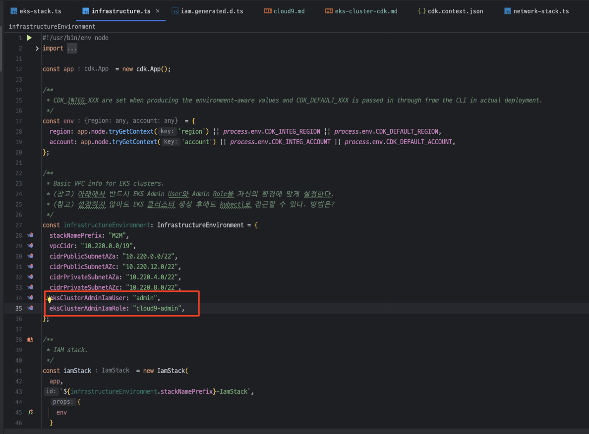
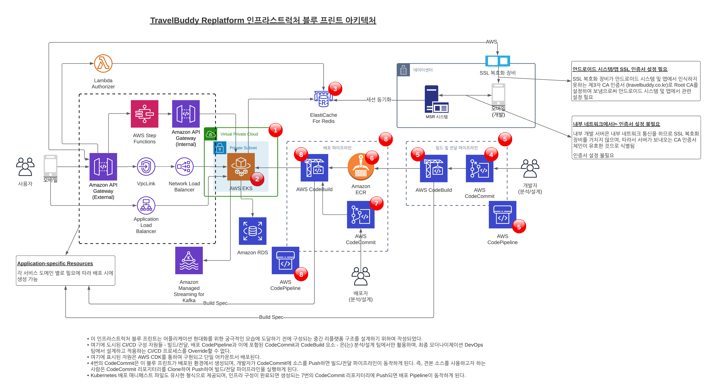
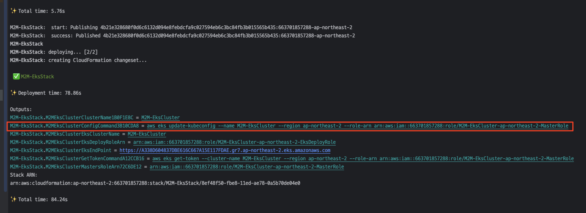

# EKS Cluster 생성

## Agenda

- AWS CDK를 사용하여 EKS 클러스터 생성하기
- (Optional) 콘솔 권한 추가하기
- 현재의 아키텍처 리뷰

## AWS CDK를 사용하여 EKS 클러스터 생성하기
우리는 이미 앞선 과정에서 테라폼 (Terraform)을 사용하여 Amazon EKS를 생성하는 과정을 배웠습니다.<br>
이번에는 AWS CDK를 사용하여 EKS를 생성해 봄으로서 각 IaC 도구가 가지는 특성을 직접 파악해 보고자 합니다.<br>
- AWS CDK의 장점 
  - Rollback 지원
  - State 파일 관리가 필요 없음
  - 개발자 친환적 - 인프라를 진정한 프로그래밍 코드로 구성
  - 필요한 Role과 Permission Policy를 자동으로 구성
- Terraform의 장점
  - 단순한 Declaritive 언어를 통해 로직을 신경쓰지 않고 인프라를 직관적으로 구성

아래 명령어를 통해, 클러스터를 배포합니다. 30 ~ 40분 정도 소요됩니다.<br>

- (참고) ```~/environment/m2m-travelbuddy/infrastructure/eks-stack.ts``` 파일 34번째 줄 근방에서 EKS Admin User와 Admin Role을 자신의 환경에 맞게 설정한 후에 진행합니다.
    
- (참고) 설정하지 않아도 EKS 클러스터 생성 후에 kubectl로 접근할 수 있습니다. 방법은?

```bash
# 1. IaC 디렉토리로 이동
cd ~/environment/m2m-travelbuddy/infrastructure

# 2. Upgrade CDK
npm uninstall -g aws-cdk
rm -rf ~/.nvm/versions/node/v16.20.0/bin/cdk
npm install -g aws-cdk
cdk --version


# 3. npm install package dependencies
npm install

# 4. AWS CDK Bootstrap
cdk bootstrap

# 4. CDK synthesize & deplloy
cdk synth && cdk deploy --all --outputs-file ./cdk-outputs.json --require-approval=never
```

배포가 진행되는 동안에 우리가 무엇을 배포하고 있는지 잠깐 살펴보도록 하겠습니다.<br>
아래 그림은 모더나이제이션의 가장 초기 단계에서 예상되는 블루프린트 아키텍처입니다.<br>
그림에 나타난 모든 구성 요소가 생성되지는 않지만 VPC, EKS 등의 핵심 자원과 파이프라인이 생성될 것입니다.<br>


배포가 성공적으로 완료되면 아래와 같이 표시됩니다.<br>


배포 이후에 안내되는 아래와 같은 "aws eks update-kubeconfig ~~~" 명령을 수행하여 EKS 클러스터에 접근하기 위한 설정을 한다.
> M2M-EksStack.M2MEksClusterConfigCommand3B10CDA8 = aws eks update-kubeconfig --name M2M-EksCluster --region ap-northeast-2 --role-arn arn:aws:iam::663701857288:role/M2M-EksCluster-ap-northeast-2-MasterRole

```bash
# ~/.kube/config 파일 설정
# (중요) 자신의 배포 결과에서 표시된 명령을 사용할 것.
aws eks update-kubeconfig --name M2M-EksCluster --region ap-northeast-2 --role-arn arn:aws:iam::663701857288:role/M2M-EksCluster-ap-northeast-2-MasterRole

# 클러스터 배포 확인
kubectl get nodes
```

## AWS 콘솔에서 EKS 클러스터 둘러보기
우리는 CDK를 통하여 EKS 클러스터를 성공적으로 배포하였습니다.<br>
이제 잠깐 AWS 콘솔을 통해서 생성된 클러스터를 둘러보도록 하겠습니다.

1. 콘솔 권한이 추가된 것을 확인
2. [kubectl과 AWS IAM Authenticator 인증](https://ssup2.github.io/theory_analysis/AWS_EKS_%EC%9D%B8%EC%A6%9D/)에 대하여


## TravelBuddy Blue Print 아키텍처
위에서 잠깐 언급되었지만, 현재 배포된 EKS 클러스터 및 추후 구성이 고려될 수 있는 요소를 포함한 TravelBuddy 어플리케이션의 Blue Print 아키텍처는 다음과 같습니다.


포함된 자원을 다이어그램으로 표시하면 위와 같으며, 이중에서 🔴로 표시된 자원이 이 패키지에 포함되어 있습니다.
1.	VPC 및 서브넷
      * 공통 네트워킹으로 정의될 경우 각 서비스 도메인에서 공용 네트워크 자원을 사용
2.	EKS Fargate 클러스터: 서비스별 자원
3.	Elasticache Redis 클러스터: 공통 자원
4.	어플리케이션 CodeCommit 리포지터리 
      * 어플리케이션 소스 코드가 저장
      * 소스 코드가 푸시되면 빌드 및 전달 파이프라인이 시작되며 (5), 컨테이너 이미지가 생성되면 ECR에 저장됩니다 (6).
5.	빌드 및 전달 CodePipeline
       * 4의 소스 코드가 Push되면 Pipeline이 동작하여 컨테이너 이미지를 생성한 후 ECR 리포지터리로 푸시
6.	Elastic Container Registry (ECR) 리포지터리
       * 5에서 생성된 컨테이너 이미지를 담는 컨테이너 레지스트리
7.	EKS 배포 매니페스트 파일용 CodeCommit 리포지터리
       * 6에 저장된 컨테이너 이미지를 EKS 클러스터로 배포하는데 필요한 Kubernetes 매니페스트 파일들을 담고 있습니다.
       * 여기에는 Deployment, Service, Service Account 및 IAM Role, ConfigMap을 설정하거나 생성하는 매니페스트 파일과 Deploy Spec 파일이 포함되어 있습니다.
8.	배포 CodePipeline
       * 6의 ECR 리포지터리에 컨테이너 이미지가 Push되면 이를 감지하여 2의 EKS 클러스터에 배포
       * 6으로부터 애플리케이션 컨테이너 이미지를 Pull 한 후, 7에서 정의된 EKS 매니페스터 파일을 적용하여 EKS 클러스터에 배포
       * (참고) Kubernetes 클러스터를 다룰 수 있도록 kubectl이 CodeBuild 실행 시 설치됩니다.
      
인프라스트럭처 레벨의 CDK가 배포되게 되면 위에서 설명된 자원이 생성된다. 이후 어플리케이션 소스 코드가 리포지터리에 Push되면 CI/CD 빌드 파이프라인이 동작하여 생성된 자원들 중 하나인 ECR에 컨테이너 이미지를 생성하게 됩니다. 이후 배포 파이프라인이 작동하여 ECR에서 컨테이너 이미지를 Pull 한 다음, 별도로 정의되는 Kubernetes 매니페스트 파일을 참조하여 해당 이미지를 최종적으로 EKS 클러스터로 배포하게 됩니다. 즉, 배포 파이프라인에서는 소스로서 사용되는 리포지터리는 (ECR 컨테이너 리포지터리 + Kubernetes 매니페스트 파일 CodeCommit 리포지터리) 의 결합으로 정의되는 점을 참고할 만합니다.


