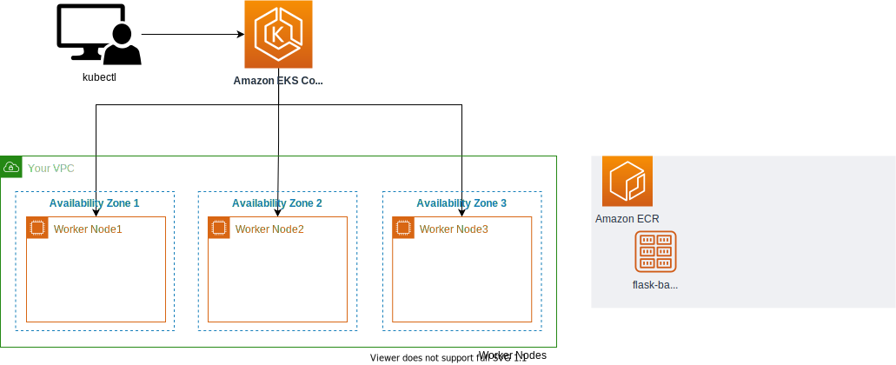

# EKS Cluster 생성

## Agenda

- eksctl을 사용하여 EKS 클러스터 생성하기
- (Optional) 콘솔 권한 추가하기
- 현재의 아키텍처 리뷰

## eksctl을 사용하여 EKS 클러스터 생성하기

```bash
cd ~/environment

cat << EOF > eks-cluster.yaml
---
apiVersion: eksctl.io/v1alpha5
kind: ClusterConfig

metadata:
  name: eks-demo # 생성할 EKS 클러스터명
  region: ${AWS_REGION} # 클러스터를 생성할 리전
  version: "1.23"

vpc:
  cidr: "10.0.0.0/16" # 클러스터에서 사용할 VPC의 CIDR
  nat:
    gateway: HighlyAvailable

managedNodeGroups:
  - name: node-group # 클러스터의 노드 그룹명
    instanceType: m5.xlarge # 클러스터 워커 노드의 인스턴스 타입
    desiredCapacity: 3 # 클러스터 워커 노드의 갯수
    volumeSize: 30  # 클러스터 워커 노드의 EBS 용량 (단위: GiB)
    privateNetworking: true
    ssh:
      enableSsm: true
    iam:
      withAddonPolicies:
        imageBuilder: true # Amazon ECR에 대한 권한 추가
        albIngress: true  # albIngress에 대한 권한 추가
        cloudWatch: true # cloudWatch에 대한 권한 추가
        autoScaler: true # auto scaling에 대한 권한 추가
        ebs: true # EBS CSI Driver에 대한 권한 추가

cloudWatch:
  clusterLogging:
    enableTypes: ["*"]

iam:
  withOIDC: true
EOF
```

아래 명령어를 통해, 클러스터를 배포합니다. 15~20분 정도 소요됩니다.

```bash
# 클러스터 배포
eksctl create cluster -f eks-cluster.yaml

# 확인
kubectl get nodes
```

## (Optional) 콘솔 권한 추가하기

```bash
# role ARN(Amazon Resource Number)을 정의
rolearn=$(aws cloud9 describe-environment-memberships --environment-id=$C9_PID | jq -r '.memberships[].userArn')

echo ${rolearn}

# (Optional) 해당 결과 값을 불렀을 때, assumed-role이 있다면 아래의 작업을 추가적으로 수행
assumedrolename=$(echo ${rolearn} | awk -F/ '{print $(NF-1)}')
rolearn=$(aws iam get-role --role-name ${assumedrolename} --query Role.Arn --output text)

# identity 맵핑을 생성
eksctl create iamidentitymapping --cluster eks-demo --arn ${rolearn} --group system:masters --username admin

# 확인
kubectl describe configmap -n kube-system aws-auth
```

## 현재의 아키텍처


