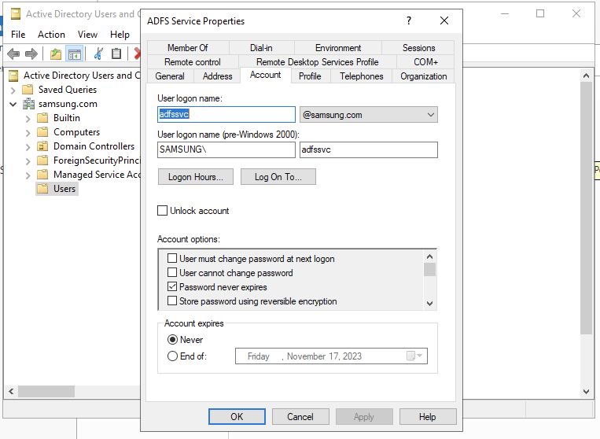
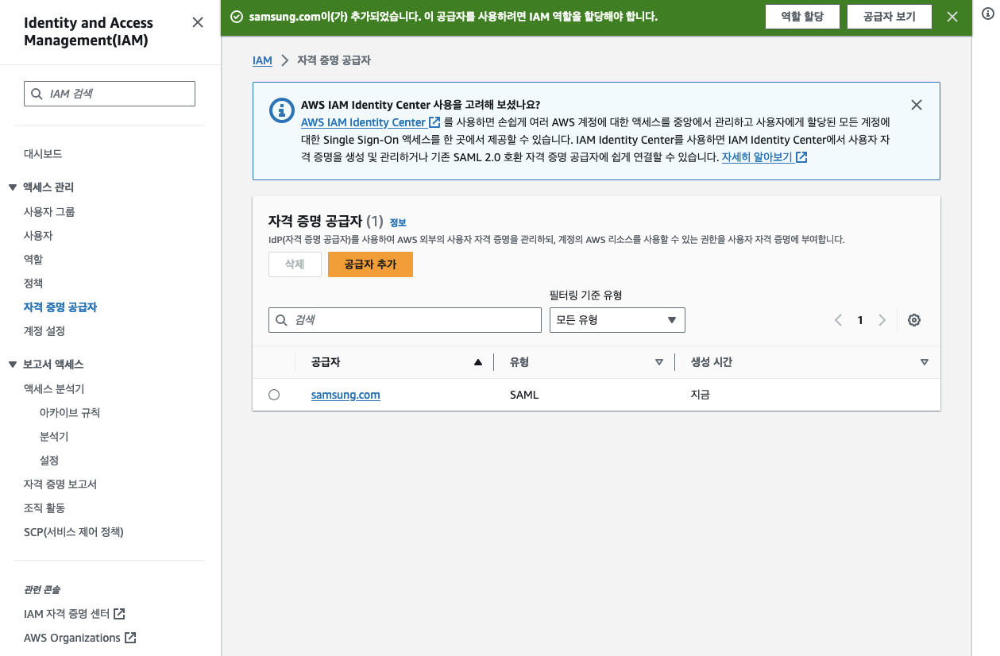

```shell
New-SelfSignedCertificate -DnsName "ad.samsung.com" -KeyAlgorithm RSA -KeyLength 2048 -CertStoreLocation "Cert:\LocalMachine\My" -NotAfter (Get-Date).AddYears(10)
```

(참고) ADFS Script
```shell
#
# Windows PowerShell script for AD FS Deployment
#

Import-Module ADFS

# Get the credential used for the federation service account
$serviceAccountCredential = Get-Credential -Message "Enter the credential for the Federation Service Account."

Install-AdfsFarm `
-CertificateThumbprint:"CBCB7C4059F42A1F7FD2736EB298983C177BE3E8" `
-FederationServiceDisplayName:"Samsung SDS" `
-FederationServiceName:"ad.samsung.com" `
-ServiceAccountCredential:$serviceAccountCredential
```

## SAML Federation Metadata (ADFS -> AWS) 설정<br>
* IDP SAML 메타데이터 파일 다운로드<br>
```shell
add-type @"
using System.Net;
using System.Security.Cryptography.X509Certificates;
public class TrustAllCertsPolicy : ICertificatePolicy {
    public bool CheckValidationResult(
        ServicePoint srvPoint, X509Certificate certificate,
        WebRequest request, int certificateProblem) {
            return true;
        }
 }
"@
[System.Net.ServicePointManager]::CertificatePolicy = New-Object TrustAllCertsPolicy
Invoke-WebRequest -Uri https://localhost/FederationMetadata/2007-06/FederationMetadata.xml -OutFile FederationMetadata.xml
```

* Federation 서비스가 작동중인지 검사<br>
브라우저에서 아래 링크가 표시되는지 확인<br>
```https://localhost/adfs/fs/federationserverservice.asmx```

* 해당 파일 전체 내용을 클립보드 복사 (Windows RDP -> 로컬 컴퓨터), 저장, IAM 설정<br>


## Relying Party 설정
* (참조)
  - https://docs.aws.amazon.com/ko_kr/athena/latest/ug/odbc-adfs-saml.html
  - https://community.acquia.com/acquiadam/s/article/How-do-I-configure-a-SAML-SSO
  - https://stackoverflow.com/questions/11693297/what-are-the-different-nameid-format-used-for
  - https://docs.oasis-open.org/security/saml/Post2.0/sstc-saml-tech-overview-2.0.html
  - https://learn.microsoft.com/en-us/windows-server/identity/ad-fs/technical-reference/the-role-of-claims
  - "http://schemas.microsoft.com/ws/2008/06/identity/claims/windowsaccountname"
  - https://learn.microsoft.com/en-us/archive/blogs/card/name-identifiers-in-saml-assertions

* (참고) "Windows Account Name" Claim이란?
```shell
...
</auth:ClaimType><auth:ClaimType Uri="http://schemas.microsoft.com/ws/2008/06/identity/claims/windowsaccountname" Optional="true" xmlns:auth="http://docs.oasis-open.org/wsfed/authorization/200706"><auth:DisplayName>Windows account name</auth:DisplayName><auth:Description>The domain account name of the user in the form of domain\user</auth:Description></auth:ClaimType>
...
```

## ADFS에서 Relying Party Endpoint (AWS) 설정 시 SSL 오류 관련<br>
* URL: 
  * https://signin.aws.amazon.com/static/saml-metadata.xml

[Configuring TLS Cipher Suite Order](https://learn.microsoft.com/en-us/windows-server/security/tls/manage-tls)

Resolution<br>
-Prioritize the below Cloud preferred ciphers suites ( one or more ) on all the windows machines Where the ADFS/MFA agent is installed and reboot them.

TLS_DHE_RSA_WITH_AES_256_GCM_SHA384 (0x9f)
TLS_DHE_RSA_WITH_AES_128_GCM_SHA256 (0x9e)
TLS_ECDHE_RSA_WITH_AES_256_GCM_SHA384 (0xc030)
TLS_ECDHE_RSA_WITH_AES_128_GCM_SHA256 (0xc02f)

TLS_DHE_RSA_WITH_AES_256_GCM_SHA384,TLS_DHE_RSA_WITH_AES_128_GCM_SHA256,TLS_ECDHE_RSA_WITH_AES_256_GCM_SHA384,TLS_ECDHE_RSA_WITH_AES_128_GCM_SHA256,TLS_AES_256_GCM_SHA384,TLS_AES_128_GCM_SHA256,TLS_ECDHE_ECDSA_WITH_AES_256_GCM_SHA384,TLS_ECDHE_ECDSA_WITH_AES_128_GCM_SHA256,TLS_ECDHE_RSA_WITH_AES_256_GCM_SHA384,TLS_ECDHE_RSA_WITH_AES_128_GCM_SHA256,TLS_DHE_RSA_WITH_AES_256_GCM_SHA384,TLS_DHE_RSA_WITH_AES_128_GCM_SHA256,TLS_ECDHE_ECDSA_WITH_AES_256_CBC_SHA384,TLS_ECDHE_ECDSA_WITH_AES_128_CBC_SHA256,TLS_ECDHE_RSA_WITH_AES_256_CBC_SHA384,TLS_ECDHE_RSA_WITH_AES_128_CBC_SHA256,TLS_ECDHE_ECDSA_WITH_AES_256_CBC_SHA,TLS_ECDHE_ECDSA_WITH_AES_128_CBC_SHA,TLS_ECDHE_RSA_WITH_AES_256_CBC_SHA,TLS_ECDHE_RSA_WITH_AES_128_CBC_SHA,TLS_RSA_WITH_AES_256_GCM_SHA384,TLS_RSA_WITH_AES_128_GCM_SHA256,TLS_RSA_WITH_AES_256_CBC_SHA256,TLS_RSA_WITH_AES_128_CBC_SHA256,TLS_RSA_WITH_AES_256_CBC_SHA,TLS_RSA_WITH_AES_128_CBC_SHA,TLS_RSA_WITH_3DES_EDE_CBC_SHA,TLS_RSA_WITH_NULL_SHA256,TLS_RSA_WITH_NULL_SHA,TLS_PSK_WITH_AES_256_GCM_SHA384,TLS_PSK_WITH_AES_128_GCM_SHA256,TLS_PSK_WITH_AES_256_CBC_SHA384,TLS_PSK_WITH_AES_128_CBC_SHA256,TLS_PSK_WITH_NULL_SHA384,TLS_PSK_WITH_NULL_SHA256

-Those Ciphers suites can be prioritized by GPO following the below MSFT KB or by putting them on the top of the Ciphers suites in any tool used to view and enable or disable protocols, ciphers suites on Windows Servers (i.e. IIS Crypto).

https://docs.microsoft.com/en-us/windows-server/security/tls/manage-tls

```shell
gpedit.msc
```

(참고) 로컬에 다운로드 후 Import로 Workaround 가능

```shell
Invoke-WebRequest -Uri https://signin.aws.amazon.com/static/saml-metadata.xml -OutFile saml-metadata.xml
```

## ADFS 테스팅<br>
https://localhost/adfs/ls/IdpInitiatedSignOn.aspx

만약 에러가 발생하면<br>
```shell
Set-ADFSProperties -ExtendedProtectionTokenCheck None
```

```shell
Get-AdfsProperties | Select-Object EnableldpInitiatedSignonpage

# hosts 파일 혹은 DNS 레코드에: [ad.samsung.com](http://ad.samsung.com/)

Set-AdfsProperties –EnableIdpInitiatedSignonPage $True

Restart-Service adfssrv -Force
```

[AD FS 2.0 Troubleshooting Guide](https://learn.microsoft.com/en-us/previous-versions/windows/it-pro/windows-server-2008-R2-and-2008/ff641699(v=ws.10)?redirectedfrom=MSDN)

필요하면 DNS 이름에 ```ad.samsung.com``` 주소를 서버 자신의 Private IP로 추가할 것.

[//]: # (Invoke-WebRequest -Uri https://localhost/FederationMetadata/2007-06/FederationMetadata.xml -OutFile FederationMetadata.xml -SkipCertificateCheck)
