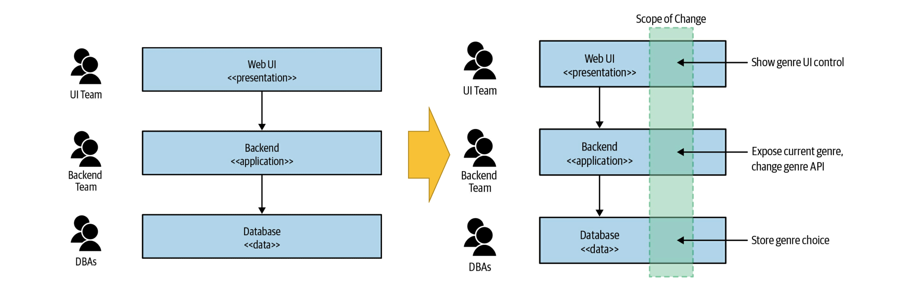
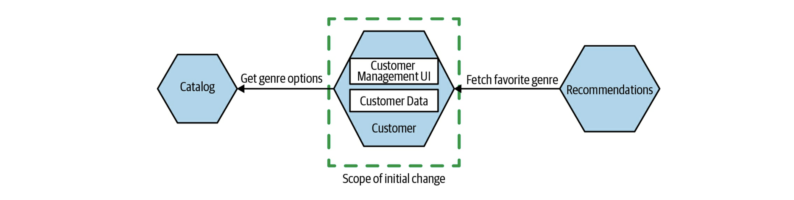

# 마이크로서비스란?

_Monolith to Microservices_ - Sam Newman

## Agenda

- 배포 독립성
- 비즈니스 도메인 중심으로 설계
- 자체적으로 데이터를 소유
- 마이크로서비스의 Pros and Cons
- Microservice Premium
- 목표에 대한 이해
- 마이크로서비스를 선택해야 하는 이유는 무엇입니까?
- 마이크로서비스가 나쁜 선택이 되는 경우는 언제입니까?

## 배포 독립성

- loosely coupled (다른 변경 없이 하나의 서비스 변경 가능. 서비스 경계가 중요)

## 비즈니스 도메인 중심으로 설계

- 서비스 하나를 변경하는 것보다 두 개를 변경하는 것은 어렵다.

- 한 가지 간단한 기능 변경을 가정 - 자신이 선호하는 장르를 선택할 수 있도록
- 3-tier 아키텍처는 Conway's Law의 좋은 예시
- 이 아키텍처는 관련 기술의 응집력은 높지만 비즈니스 기능의 응집력은 낮음
- 기능을 쉽게 변경하고자 한다면 비즈니스 응집력을 선택하는 것이 유리

- 고객의 정보를 업데이트할 수 있는 자체 UI를 가지고 있는 독립된 고객 서비스
- 별도의 catalog 서비스로부터 가능한 장르의 목록을 수신
- 새로운 추천 서비스는 고객의 선호 장르 정보에 access 가능

## 자체적으로 데이터를 소유

- 마이크로서비스 간에 데이터베이스를 공유하지 않아야 한다는 지점에서 많은 어려움이 발생
- 독립적으로 배포하려면 필수적으로 안정적인 인터페이스를 제공해야 함
- 데이터와 내부 동작에 대한 캡슐화는 비즈니스 기능의 응집력을 향상시키도, 커플링을 줄임

## 마이크로서비스의 Pros and Cons

| Pros                        | Cons                                           |
| --------------------------- | ---------------------------------------------- |
| 쉬운 확장                   | 네트워크 통신으로 인한 지연                    |
| 안정성 향상                 | 서비스간 호출 실패 가능성으로 인한 복잡도 증가 |
| 기술이 아닌 비즈니스에 집중 |                                                |
| 구조적 유연성               |                                                |

## Microservice Premium

Microservice로 전환해야 하는 정확한 기준을 제시하기에는 아직 우리의 축적된 경험이 부족한 상태여서 어렵지만, 주의할 점은 정확한 분석과 목표 없이 마이크로서비스로 전환하는 것은 상당한 Microservice Premium을 발생시킬 수 있다는 것입니다.

- 복잡성이 낮은 시스템은 마이크로서비스로 인한 관리 부담으로 생산성 저하
- 복잡성이 높은 시스템은 커플링 감소로 인해 마이크로서비스가 유리
- 복잡성이 일정 수준으로 높아지면 생산성이 급격히 떨어지는 구간이 존재
  

출처: [Microservice Premium](https://martinfowler.com/bliki/MicroservicePremium.html)

## 목표에 대한 이해

- 마이크로서비스는 목표가 아니며, 마이크로서비스는 성공을 보장하지 않습니다.
- 세 가지 중요한 질문
  - 달성하고자 하는 것이 무엇입니까?
  - 마이크로서비스 사용에 대한 대안을 생각해 보셨습니까?
  - 전환이 작동하는지 어떻게 알 수 있습니까?

## 마이크로서비스를 선택해야 하는 이유는 무엇입니까?

- 팀 자율성 향상
- 출시 시간 단축
- 부하에 대해 비용 효율적으로 확장
- 안정성 향상
- 개발자 수 확장
- 신기술 수용

## 마이크로서비스가 나쁜 선택이 되는 경우는 언제입니까?

- 도메인이 명확하지 않을 때
- 스타트업
- 고객이 설치하여 관리하는 소프트웨어
- 정당한 이유가 없을 때
