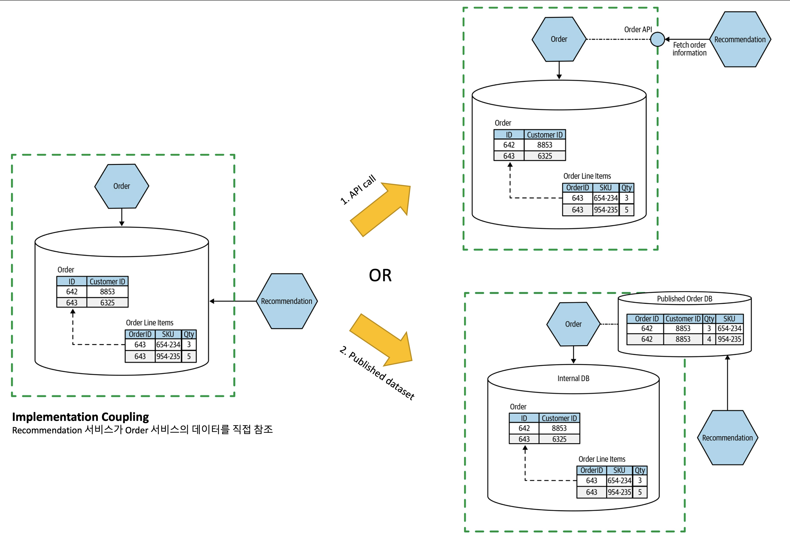
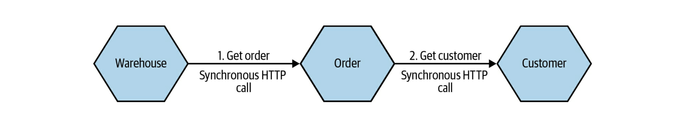

# 모노리스(monolith)란?

- 한 번에 배포해야 하는 단위?

## Agenda

- Monolith의 종류
  - 단일 프로세스 monolith
  - Modular monolith
  - Distributed monolith
- Monolith의 장단점
- Monolith를 바꿀 것인가 바꾸지 않을 것인가?
- 커플링과 응집도
  - Implementation Coupling
  - Temporal Coupling
  - Deployment Coupling

## 모노리스(monolith) 종류

### 단일 프로세스 Monolith

- 모든 코드가 단일 프로세스로 배포되는 시스템
- 고가용성을 위해 이런 프로세스 인스턴스가 여러 개 존재 가능
- 보통 database로부터 데이터를 읽거나 저장

### Modular Monolith

- 독립적으로 동작하는 여러 module이 하나의 프로세스를 구성
- 모든 코드를 한 번에 배포
- module의 경계를 잘 정의하면 높은 수준의 병렬 작업이 가능하며, MSA의 여러 가지 어려움을 회피할 수 있는 대안 (Shopify)
- 보통 database가 잘 분리되지 않는 경향이 있으며, 이런 경우 향후 monilith를 분해해야 하는 경우 난이도가 크게 증가하는 결과를 초래

### Distributed Monolith

- 여러 개의 서비스로 구성되어 있지만, 전체 서비스를 함께 배포해야 하는 시스템
- 단일 프로세스 monolith의 단점과 분산 시스템의 단점을 모두 가지고 있음

## Monolith의 Pros and Cons

| Cons                | Pros               |
| ------------------- | ------------------ |
| 커플링에 취약       | 간단한 배포 구조   |
| Delivery contention | 테스트 용이성      |
|                     | 높은 코드 재사용성 |

## Monolith를 바꿀 것인가 바꾸지 않을 것인가?

- Seam - _Working Effectively with Legacy Code by Michael Feathers (Prentice Hall, 2004)_
- Modular monolith - Seam이 식별되면 다음 단계로 고려. monolith의 대부분의 문제를 해결

## Coupling and Cohesion

Larry Constantine이 설명한 Coupling과 Cohesion 개념은 다음과 같습니다.

> A structure is stable if cogesion is high, and coupling is low.
> _- Larry Constantine_
>
> - Coupling: 하나의 변경이 다른 곳의 변경을 요구
> - Cohesion: 관련성 있는 코드 끼리 모으는 것(grouping) - "함께 바뀌는 코드는 함께 두어라"

많은 사람들이 혼용해서 사용하는 정보은닉과 캡슐화의 차이를 알아봅니다.

> Information Hiding과 Encapsulation은 서로 관련되어 있지만, 정의로서는 차이가 있다.
>
> - Information Hiding: 자주 변하는 내부 로직과 자주 변하지 않는 인터페이스를 분리하자는 아이디어
> - Encapsulation: OOP에서 나오는 개념으로 여러 가지를 하나의 container로 감싸서 사용하는 것

이제부터 Coupling의 몇 가지 종류를 알아봅니다.

### Implementation Coupling

서비스(A)가 다른 서비스(B)의 구현에 의존하는 coupling으로서, 다른 서비스(B)가 변경되면 여기에 의존하는 서비스(A)도 함께 변경된다.

위의 예시처럼 다른 서비스의 DB를 직접 access하는 경우, API를 추가하여 이를 호출하거나, 다를 서비스를 위한 dataset을 제공하여 이를 access 하도록 하는 것이 좀 더 나은 선택이다.

### Temporal Coupling

일반적으로 분산 환경에서 동기적 호출로 인해 발생하는 runtime coupling을 의미하며, 캐시 도입 또는 비동기 호출 사용 등 다양한 방법으로 coupling을 줄일 수 있다.

### Deployment Coupling

일부 기능이 변경되었을 때 변경되지 않은 모듈을 포함한 전체 시스템을 함께 배포해야 할 때, 이를 deployment coupling이라고 함.
