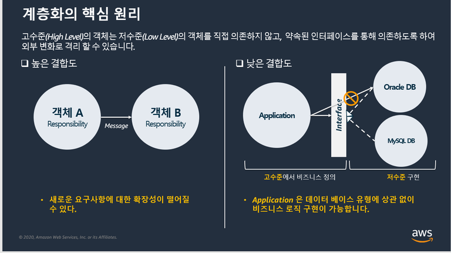
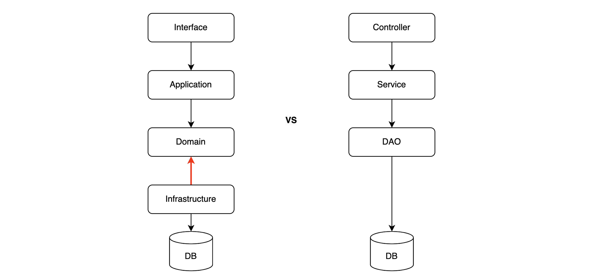

# 패키지 구조

## Agenda

- 계층화를 하는 이유
- Layered Architecture
- hotelspecial 패키지 구조 설명

## 계층화를 하는 이유

계층화가 필요한 이유를 알아봅니다.

## Layered Architecture

클린 아키텍처를 기반으로 여기서 제안하는 layered architecture의 핵심은 domain layer와 infrastructure layer 간의 의존성 역전입니다.

Interface

- 인터페이스 계층 (Interface layer)
- client 와 communication 을 위한 interface
- 서비스 성격에 따라 web, api, message, batch
- presenting UI to end-user, 대화 해석

Application

- 서비스 계층 (Service layer)
- 고수준으로 추상화된 service(특정 행위 추상화) 객체 배치
- 시나리오에 따른 도메인 로직 호출
- 서비스 트랜잭션 관리

Domain

- 도메인 계층 (Domain layer)
- 비지니스 (도메인) 로직 관리
- 핵심 layer

Infrastructure

- 영속 계층 (Persistence layer)
- technical part, 세부 기술
- 서비스 및 비지니스와 구현 기술 분리
- DIP로써 다른 layer에 기술이 주입됨

## Hotelspecial Package 구조

- 네 가지 layer 별로 프로젝트를 분리
- 프로젝트 단위로 의존성을 정의하여 layer 간 의존성을 일부 강제화
