# (DC 측) VPN 연결 설정

AWS 측 아키텍처에서는 3개의 VPC를 상호 연결하기 위해 트랜짓 게이트웨이를 만들었고, 트랜짓 게이트웨이에 VPN Attachment를 생성함으로써 데이터센터와 통합할 준비를 마쳤습니다.<br>
이번에는 시뮬레이션된 데이터센터 환경을 통합하기 위해 트랜짓 게이트웨이와 데이터센터의 고객 게이트웨이 디바이스 간에 VPN 연결을 설정합니다. 시뮬레이션 환경이므로 Bastion 호스트에서 실행되는 고객 게이트웨이로 Openswan을 사용합니다.


## 1. 데이터센터의 VPC 라우팅 설정하기
Bastion 호스트를 고객 게이트웨이로 사용할 것이므로, 해당 EC2 인스턴스를 라우터로 사용하여 트랜짓 게이트웨이에 연결된 VPC에 연결하도록 시뮬레이션된 데이터센터 VPC를 구성해야 합니다.<br>
1. ```EC2 console - Instances```로 이동합니다.
2. Bastion 호스트를 찾아 선택합니다. 호스트 이름은 OnPremBastion으로 시작합니다.
3. "Actions" 메뉴에서 "Networking"을 선택한 다음 "Change Source/Destination Check"을 선택합니다.
    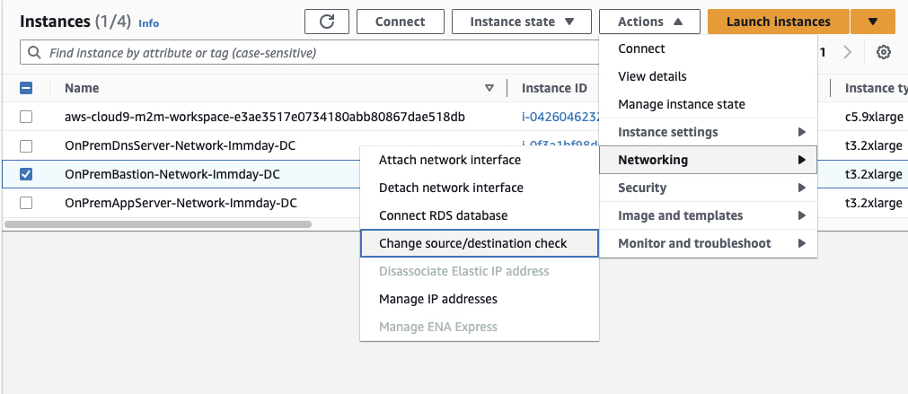

4. "Stop"을 선택합니다. 이렇게 하면 인스턴스를 라우터로 사용하여 EC2 인스턴스의 자체 IP 주소로 향하지 않는 트래픽을 전달할 수 있습니다. 이 옵션을 사용하지 않으면 EC2는 소스 또는 대상 IP 주소가 인스턴스의 IP 주소와 일치하지 않는 IP 패킷을 전달하지 않습니다.
    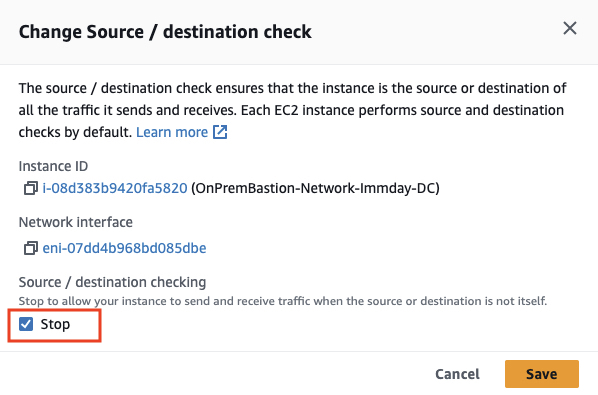

5. EC2 콘솔에서 Bastion 호스트를 선택한 상태에서 하단 창에서 보안 그룹을 클릭하여 해당 규칙을 보고 편집합니다. AWS VPN 엔드포인트가 IPSEC를 통해 인스턴스와 통신할 수 있도록 허용해야 합니다.<br>
    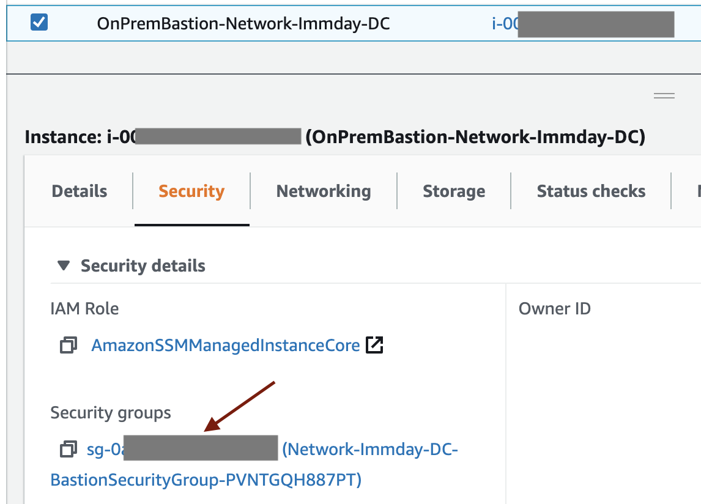

6. "Edit inbound rules"를 선택합니다.<br>
    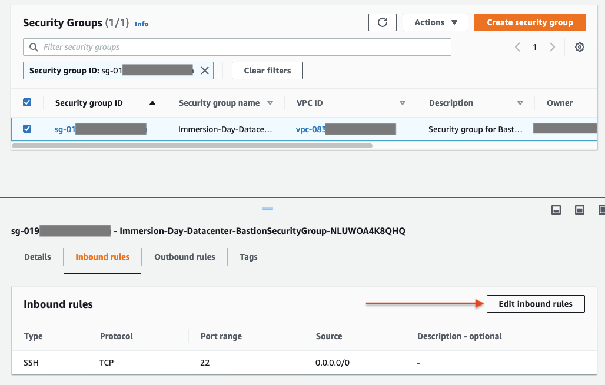

7. (AWS 담당자에게 정보 요청) AWS에서 VPN 연결을 생성할 때 함께 생성된 두 개의 "외부" 터널 주소에 대해 UDP 포트 500 및 4500에 대한 규칙을 추가하세요. 대화 상자에서 CIDR 표기법으로 주소를 입력해야 하므로, 두 터널 IP 주소 끝에 /32를 추가하기만 하면 됩니다. 완료되면 규칙 저장을 클릭합니다.
    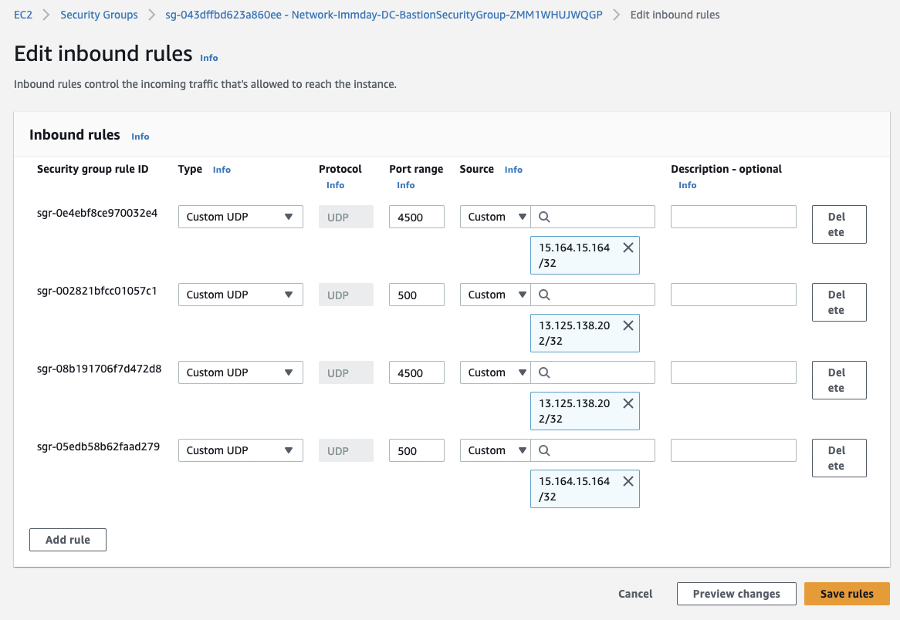

8. 마지막으로, 시뮬레이션된 데이터센터 환경에 대한 VPC 경로 테이블을 업데이트하여 Bastion 호스트의 Openswan을 통해 AWS 환경으로 트래픽을 전송할 수 있도록 합니다. VPC 콘솔로 이동하여 ```Route tables```을 선택합니다.

9. 시뮬레이션된 데이터센터 환경에 대한 경로 테이블을 찾습니다. 이 경로 테이블은 DNS 서버 및 앱 서버를 포함하는 Public 및 Private 서브넷에 사용됩니다. 이름은 ```OnPremPublicRouteTable``` 및 ```OnPremNatRouteTable```로 시작합니다. ```Routes``` 탭을 선택합니다.<br>
    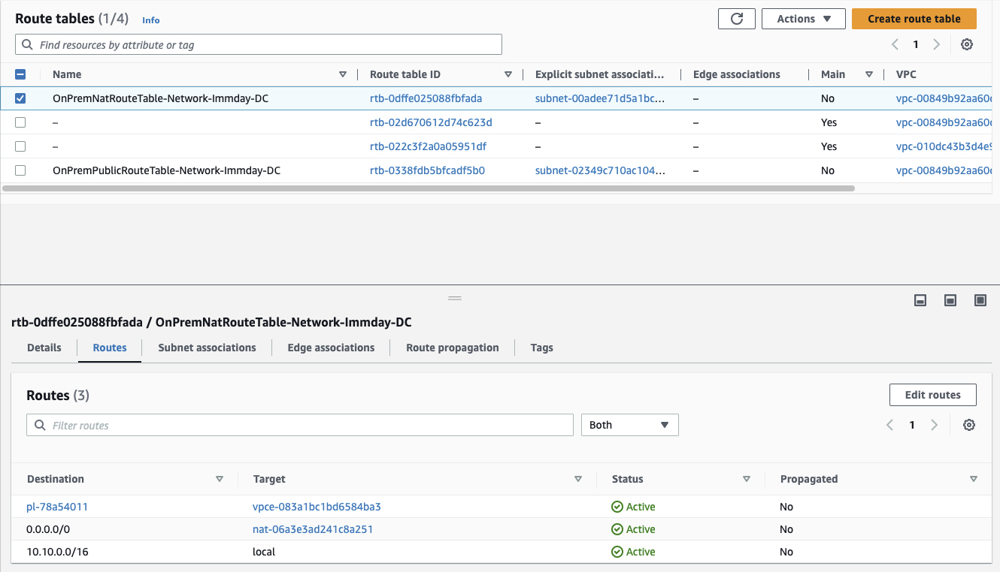

10. (중요: 두 Route Table 모두에 대해 수행) "Edit routes"를 클릭합니다. VPN으로 연결된 AWS VPC 환경에 대한 경로를 추가합니다. 경로는 ```10.0.0.0/14```로 요약할 수 있습니다 (Why?). 대상으로 "인스턴스"를 선택하고 Bastion 호스트를 선택합니다. 완료되면 "Save route"을 클릭합니다. <u>**우리는 시뮬레이션된 데이터센터를 가정하므로 AWS 기능을 사용하지만, 실제 현장에서는 데이터센터의 물리적인 네트워크 설정을 통해 이루어지는 작업임을 강조하고 싶습니다.**</u>
    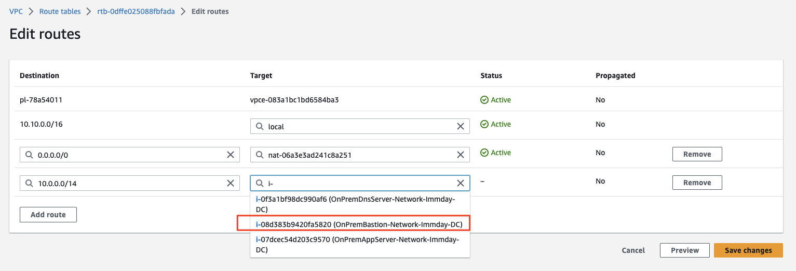

## 2. Openswan 설정 및 VPN 터널 기동

이제 시뮬레이션된 데이터센터으 네트워크를 구성하고 AWS 클라우드에 대한 VPN 연결을 만들었으므로, 배스티온 호스트에서 Openswan을 구성하고 터널을 실행할 준비가 되었습니다. Openswan은 이미 Bastion 호스트에 설치되어 있습니다. [(AWS 측) 고객 게이트웨이 (Customer Gateway) 생성](./create-customer-gateway.md)에서 다운로드한 구성 파일을 사용하여 VPN을 구성합니다. (AWS측 담당자에게 해당 파일을 요청)

1. EC2 콘솔에서 Bastion 인스턴스에 대한 연결 옵션을 사용하여 인스턴스에 연결합니다(세션 관리자).

2. IP 포워딩을 사용하도록 /etc/sysctl.conf를 편집합니다:<br>
    ```bash
    sudo vi /etc/sysctl.conf
    ```

    다음 파라미터를 파일의 끝에 추가합니다.
    ```bash
    net.ipv4.ip_forward = 1
    net.ipv4.conf.default.rp_filter = 0
    net.ipv4.conf.default.accept_source_route = 0
    ```

3. 변경 사항을 다음 명령을 통해 적용합니다:
    ```bash
    sudo sysctl -p
    ```

4. AWS 측으로부터 전달된 고객 게이트웨이용 구성 파일을 엽니다. 이 파일을 통해 터널 1에 대한 Openswan을 구성할 것입니다. Openswan은 기본 제공 터널 장애 조치 기능을 제공하지 않으므로 터널 중 하나만 구성할 것입니다.

5. DC 측 Bastion 호스트의 ```/etc/ipsec.d``` 디렉토리 내에 ```aws.conf```파일을 새로 생성하면서 편집합니다.
    ```bash
    sudo vi /etc/ipsec.d/aws.conf
    ```
  
6. 구성 파일 내에서 "conn Tunnel1" 섹션을 복사하여 붙여넣습니다 (원하는 편집기를 사용하여 변경합니다. 붙여넣기는 nano보다 vi에서 더 잘 작동합니다. nano에서는 줄 바꿈 수정이 필요할 수 있습니다).<br>
    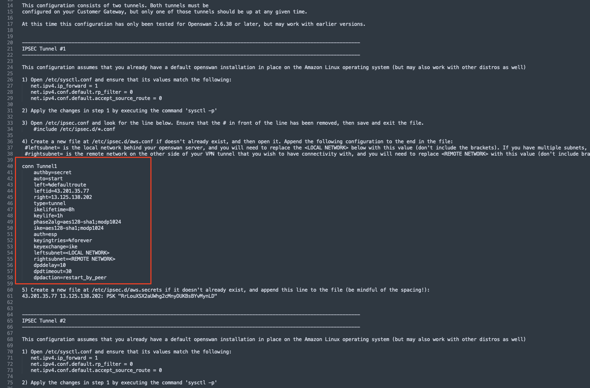

7. 아래와 같이 변경합니다:<br>
    - ```auth=esp``` 라인을 삭제
    - ```phase2alg=``` 라인의 ```aes128-sha1;modp1024``` 값을 ```aes_gcm```으로 변경
    - ```ike=``` 라인의 ```s128-sha1;modp102``` 값을 ```aes256-sha2_256;dh14```으로 변경
    - ```leftsubnet=``` 라인의 ```<LOCAL NETWORK>``` 부분을 데이터센터의 CIDR 블록인 ```10.10.0.0/16```으로 변경
    - ```rightsubnet=``` 라인의 ```<REMOTE NETWORK>``` 부분을 AWS 클라우드의 CIDR 블록인 ```10.0.0.0/14```으로 변경

8. 최종적인 모습은 다음과 같습니다.<br>
    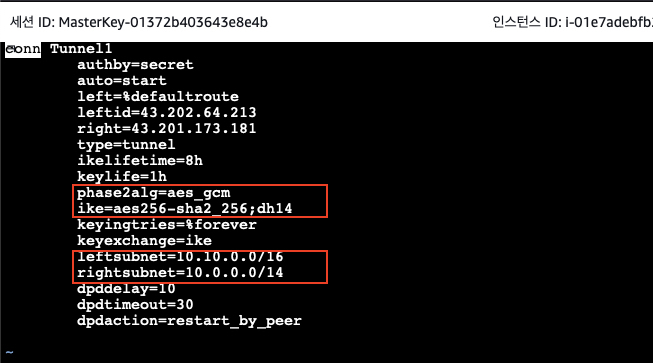

9. ```/etc/ipsec.d``` 디렉토리 내에 ```aws.secrets``` 파일을 생성하면서 바로 편집합니다.<br>
    ```bash
    sudo vi /etc/ipsec.d/aws.secrets
    ```

10. 구성 파일 내의 ```(5) Create a new file ...``` 로 시작되는 부분의 아래 라인을 복사하여 붙여 넣습니다.<br>
    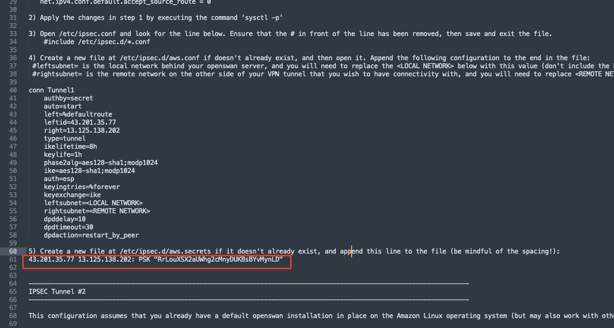
    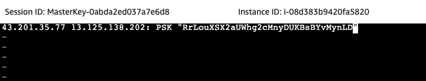

11. ```Openswan```을 활성화하고 시작합니다.

    ```bash
    sudo systemctl enable ipsec.service
    sudo ipsec start
    ```

12. AWS 측으로 트래픽을 전송하여 터널을 가동하세요.
    > (참고)
    > AWS VPN 연결은 IKEv1을 사용하므로 고객 측에서 Initiation 될 때 연결됩니다. 따라서 시뮬레이션된 온프레미스 환경에서 AWS VPC 중 하나로 일부 트래픽을 전송해야 합니다.

13. AWS 측의 VPC 0, VPC 1 또는 VPC 2에 있는 세 개의 EC2 인스턴스 중 하나의 프라이빗 IP 주소를 찾아 Bastion 호스트에서 Ping을 해봅니다:
    > (참고)
    > 터널이 나타나고 핑 응답이 표시되기 시작하기까지 최대 30초가 걸릴 수 있습니다.

    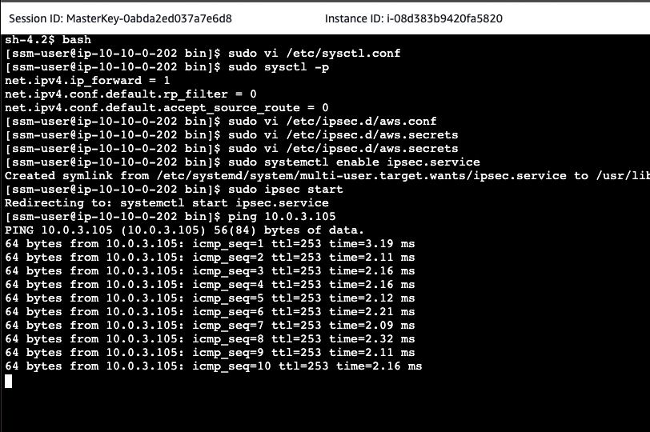<br>
    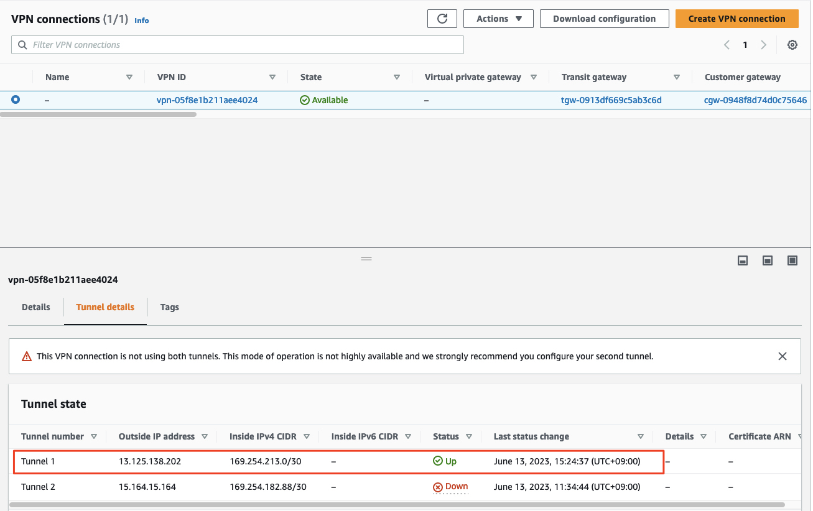
    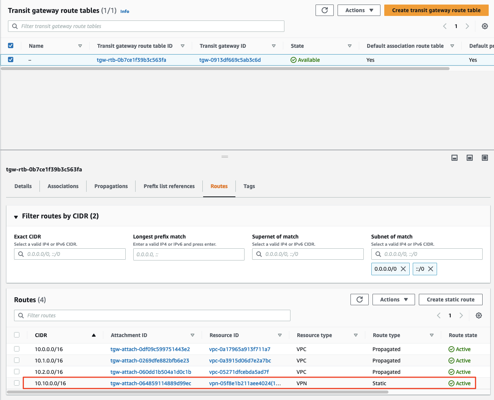

---

이제까지 구성한 사항을 간략하게 그려보면 다음과 같습니다.<br>
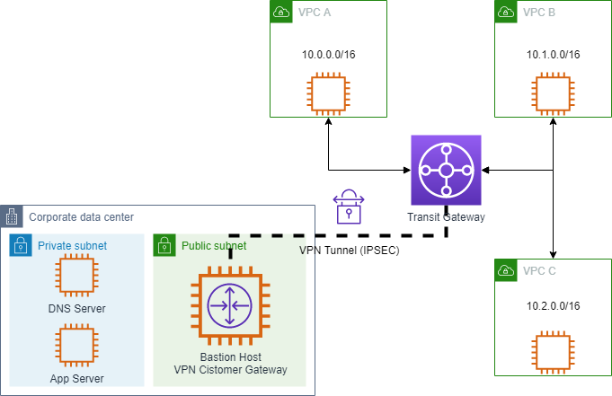
